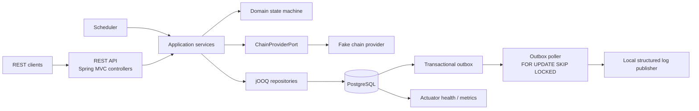
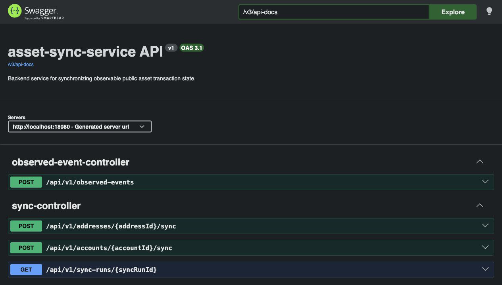
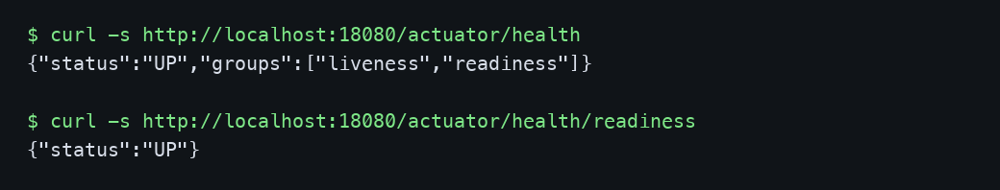
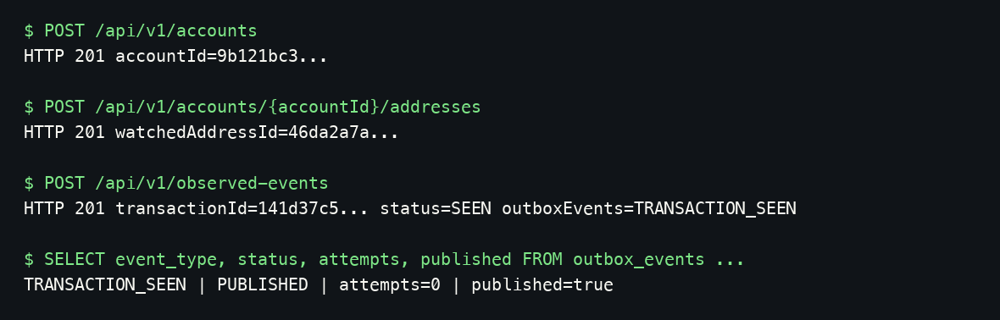

# asset-sync-service


[](https://github.com/AsyncAssassin/asset-sync-service/actions/workflows/ci.yml)
[](https://github.com/AsyncAssassin/asset-sync-service/releases/tag/v0.1.0)

`asset-sync-service` is a backend MVP for synchronizing public account, watched-address, and observed transaction lifecycle state. It accepts observed chain events through a REST API or a fake provider sync path, applies an idempotent domain state machine, stores the result in PostgreSQL, and emits lifecycle changes through a transactional outbox with a local structured-log publisher.

## At A Glance

| Area | Current MVP |
| --- | --- |
| Runtime | Kotlin, Java 21, Spring Boot 3.x, blocking Spring MVC |
| Persistence | PostgreSQL 17, Liquibase migrations, jOOQ repositories |
| API | Versioned REST API under `/api/v1`, Spring `ProblemDetail`, OpenAPI |
| Reliability | Natural keys, PostgreSQL constraints, row locks, transactional outbox, retry/backoff |
| Observability | Actuator health/readiness/metrics, structured domain logs |
| Testing | Unit tests plus Testcontainers PostgreSQL integration tests |
| External systems | Docker Compose PostgreSQL only; fake in-process chain provider |

## Implemented Features

- Account creation and lookup.
- Watched address registration and account-level address listing.
- Observed event ingestion for `local-evm`.
- Idempotent transaction lifecycle transitions: `SEEN`, `CONFIRMED`, and `REVERTED`.
- Outbox event creation for meaningful transaction state changes.
- Manual sync by watched address or account through the fake chain provider.
- Sync run inspection.
- Scheduled outbox publishing to structured logs.
- Liveness, readiness, metrics, Swagger UI, and OpenAPI JSON.

## Architecture

PostgreSQL is the source of truth for accounts, watched addresses, observed transactions, sync runs, and outbox events. Application services orchestrate use cases, the domain state machine evaluates lifecycle changes, and jOOQ repositories keep database-specific reliability behavior explicit.



Detailed documentation:

- [Architecture](docs/architecture.md)
- [API](docs/api.md)
- [Database](docs/database.md)
- [Failure modes](docs/failure-modes.md)
- [Testing](docs/testing.md)
- [Implementation plan](docs/implementation-plan.md)

## Screenshots

Swagger UI shows the generated OpenAPI surface exposed by the running service.



Actuator health captures show the service and readiness endpoints returning `UP`.



The outbox smoke capture shows a real observed event reaching a `PUBLISHED` outbox row.



## API And OpenAPI

When the app is running:

- Swagger UI: [http://localhost:18080/swagger-ui.html](http://localhost:18080/swagger-ui.html)
- OpenAPI JSON: [http://localhost:18080/v3/api-docs](http://localhost:18080/v3/api-docs)

Current public endpoints:

```text
POST /api/v1/accounts
GET  /api/v1/accounts/{accountId}
POST /api/v1/accounts/{accountId}/addresses
GET  /api/v1/accounts/{accountId}/addresses
POST /api/v1/observed-events
POST /api/v1/addresses/{addressId}/sync
POST /api/v1/accounts/{accountId}/sync
GET  /api/v1/sync-runs/{id}
```

Transaction read/list endpoints are intentionally deferred and are not exposed by this MVP.

## Prerequisites

- Java 21
- Docker and Docker Compose

Gradle commands that compile the service also run `generateJooq`, which starts a temporary PostgreSQL container through Testcontainers. Generated jOOQ sources are written to `build/generated/sources/jooq/main/kotlin` and are not committed.

## Quickstart

Start PostgreSQL on an alternate host port:

```bash
ASSET_SYNC_DB_PORT=55432 docker compose up -d postgres
```

Run the app locally against that database in another terminal:

```bash
ASSET_SYNC_DB_PORT=55432 SERVER_PORT=18080 ./gradlew bootRun
```

Check readiness:

```bash
curl -s http://localhost:18080/actuator/health/readiness
```

Stop containers when done:

```bash
docker compose down -v
```

## Demo Flow

The commands below assume PostgreSQL is running on `55432` and the app is running on `18080` as shown in the quickstart. They use `python3` only to extract JSON ids into shell variables; if you prefer no parser, run each `curl`, copy the returned `id`, and replace the variables manually.

Create an account:

```bash
ACCOUNT_JSON=$(curl -s -X POST http://localhost:18080/api/v1/accounts \
  -H 'Content-Type: application/json' \
  -d '{"externalRef":"customer-local-001"}')

printf '%s\n' "$ACCOUNT_JSON"
ACCOUNT_ID=$(printf '%s' "$ACCOUNT_JSON" | python3 -c 'import json,sys; print(json.load(sys.stdin)["id"])')
```

Register a watched address on `local-evm`:

```bash
ADDRESS_JSON=$(curl -s -X POST "http://localhost:18080/api/v1/accounts/${ACCOUNT_ID}/addresses" \
  -H 'Content-Type: application/json' \
  -d '{
    "chainId": "local-evm",
    "address": "0x742d35Cc6634C0532925a3b844Bc454e4438f44e",
    "asset": "USDC",
    "label": "primary settlement address"
  }')

printf '%s\n' "$ADDRESS_JSON"
ADDRESS_ID=$(printf '%s' "$ADDRESS_JSON" | python3 -c 'import json,sys; print(json.load(sys.stdin)["id"])')
```

Ingest an observed transaction event:

```bash
EVENT_JSON=$(curl -s -X POST http://localhost:18080/api/v1/observed-events \
  -H 'Content-Type: application/json' \
  -d '{
    "chainId": "local-evm",
    "txHash": "0x9f1c2d3e4f5061728394a5b6c7d8e9f00112233445566778899aabbccddeeff0",
    "eventIndex": 0,
    "address": "0x742d35Cc6634C0532925a3b844Bc454e4438f44e",
    "asset": "USDC",
    "amount": "12.340000000000000000",
    "blockHeight": 9123456,
    "confirmations": 1,
    "direction": "INBOUND",
    "status": "SEEN"
  }')

printf '%s\n' "$EVENT_JSON"
```

Check health, readiness, and metrics:

```bash
curl -s http://localhost:18080/actuator/health
curl -s http://localhost:18080/actuator/health/readiness
curl -s http://localhost:18080/actuator/metrics
curl -s http://localhost:18080/actuator/metrics/asset.sync.outbox.backlog.total
```

Optionally trigger sync with the fake provider. With no scripted fake-provider events in a normal local run, this should complete successfully with zero provider events.

```bash
SYNC_JSON=$(curl -s -X POST "http://localhost:18080/api/v1/addresses/${ADDRESS_ID}/sync")
printf '%s\n' "$SYNC_JSON"

SYNC_ID=$(printf '%s' "$SYNC_JSON" | python3 -c 'import json,sys; print(json.load(sys.stdin)["id"])')
curl -s "http://localhost:18080/api/v1/sync-runs/${SYNC_ID}"

curl -s -X POST "http://localhost:18080/api/v1/accounts/${ACCOUNT_ID}/sync"
```

Stop local containers:

```bash
docker compose down -v
```

## Full Docker Compose Run

Build the application jar first. This keeps jOOQ generation and its Testcontainers PostgreSQL dependency on the host, while the Docker image only packages the resulting Spring Boot jar.

```bash
./gradlew clean bootJar
```

Build and start PostgreSQL plus the application on alternate host ports:

```bash
ASSET_SYNC_DB_PORT=55433 ASSET_SYNC_HTTP_PORT=18081 docker compose up --build -d
```

Check the app:

```bash
curl -s http://localhost:18081/actuator/health
```

Stop containers:

```bash
docker compose down -v
```

## Configuration

Database configuration for the `local` profile:

| Variable | Default | Purpose |
| --- | --- | --- |
| `ASSET_SYNC_DB_HOST` | `localhost` | PostgreSQL host |
| `ASSET_SYNC_DB_PORT` | `5432` | PostgreSQL port |
| `ASSET_SYNC_DB_NAME` | `asset_sync` | Database name |
| `ASSET_SYNC_DB_USER` | `asset_sync` | Database user |
| `ASSET_SYNC_DB_PASSWORD` | `asset_sync` | Database password |
| `ASSET_SYNC_DB_MAX_POOL_SIZE` | `10` | Hikari max pool size |
| `ASSET_SYNC_DB_MIN_IDLE` | `1` | Hikari minimum idle connections |

Runtime configuration:

| Variable | Default | Purpose |
| --- | --- | --- |
| `SERVER_PORT` | `8080` | HTTP port used by the Spring Boot app |
| `ASSET_SYNC_OUTBOX_BATCH_SIZE` | `50` | Due outbox rows claimed per poll |
| `ASSET_SYNC_OUTBOX_RETRY_BACKOFF_BASE_DELAY` | `30s` | Linear retry backoff base delay |
| `ASSET_SYNC_OUTBOX_MAX_ERROR_LENGTH` | `1024` | Stored publisher error limit |
| `ASSET_SYNC_OUTBOX_SCHEDULER_ENABLED` | `true` | Enables the scheduled outbox poller |
| `ASSET_SYNC_OUTBOX_SCHEDULER_FIXED_DELAY` | `5s` | Delay between poller runs |
| `ASSET_SYNC_OUTBOX_SCHEDULER_INITIAL_DELAY` | `10s` | Initial delay before first poll |

## Reliability Highlights

- Natural idempotency keys: watched addresses use `chainId + address + asset`; observed transactions use `chainId + txHash + eventIndex + address + asset`.
- PostgreSQL constraints enforce uniqueness, enum-like values, non-negative amounts/counts, and foreign keys.
- Observed transaction ingestion locks existing rows with row-level `FOR UPDATE` before evaluating transitions.
- jOOQ uses `INSERT ... ON CONFLICT` for idempotent observed-transaction and outbox writes.
- Transactional outbox rows are inserted in the same database transaction as lifecycle state changes.
- The outbox poller claims due rows with `FOR UPDATE SKIP LOCKED`.
- Publishing is at-least-once; downstream consumers should deduplicate by event id or idempotency key.
- Failed publishes store a bounded error message and use linear retry backoff.

## Observability

- Actuator endpoints: `/actuator/health`, `/actuator/health/liveness`, `/actuator/health/readiness`, `/actuator/info`, and `/actuator/metrics`.
- Readiness includes PostgreSQL connectivity.
- The fake provider has an Actuator health contributor.
- Structured logs include account, watched-address, transaction, sync-run, provider, and outbox identifiers.
- Micrometer meters cover observed event ingestion, transaction transitions, immutable conflicts, sync runs, provider fetches and latency, outbox batches, outbox events, and outbox backlog.

## Testing

Coverage highlights:

- Unit tests for the Spring-independent domain state machine.
- Testcontainers PostgreSQL integration tests for jOOQ repositories and transactional behavior.
- Liquibase migration tests.
- API tests for controllers, DTO validation, and `ProblemDetail` responses.
- Outbox retry and concurrency tests, including `FOR UPDATE SKIP LOCKED`.
- Observability tests for health and metrics.

Verification commands:

```bash
./gradlew clean test
./gradlew clean check
./gradlew clean bootJar
docker compose config
```

## Gradle Tasks

```bash
./gradlew test
./gradlew check
./gradlew bootRun
./gradlew generateJooq
```

## MVP Boundaries

This service does not provide custody, signing, private key storage, wallet functionality, or real funds movement. The MVP also does not include a real blockchain node/provider, Kafka, SQS, Redis, balance projection, auth, multitenancy, CI/CD, or production metrics export.

## Roadmap / Deferred Scope

Future extensions, not implemented in `v0.1.0`:

- Transaction read/list endpoints.
- Real provider integration.
- Provider cursors and block-range scans.
- External broker adapter for the outbox.
- Balance projection read models.
- Auth and multitenancy.
- CI/CD.
- Production observability export.

## Repository Layout

```text
.
  Dockerfile
  docker-compose.yml
  build.gradle.kts
  settings.gradle.kts
  docs/
  src/jooqCodegen/
  src/main/kotlin/com/example/assetsync/
  src/main/resources/
  src/test/kotlin/com/example/assetsync/
  src/test/resources/
```
