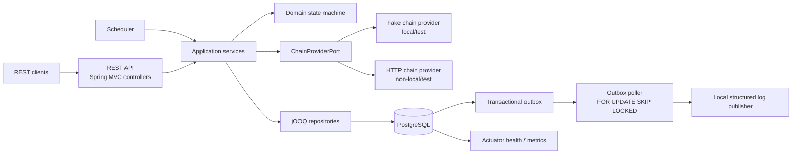
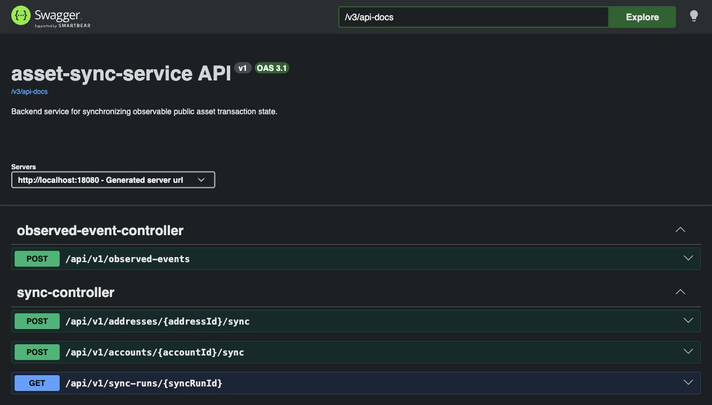
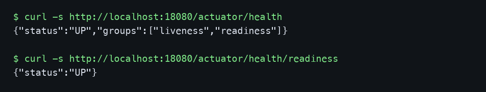
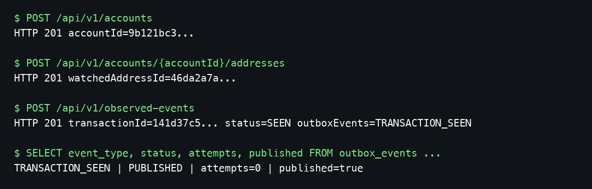

# asset-sync-service


[](https://github.com/AsyncAssassin/asset-sync-service/actions/workflows/ci.yml)
[](https://github.com/AsyncAssassin/asset-sync-service/releases)

`asset-sync-service` is a backend MVP for synchronizing public account, watched-address, and observed transaction lifecycle state. It accepts observed chain events through a REST API or the active provider sync path, applies an idempotent domain state machine, stores the result in PostgreSQL, and emits lifecycle changes through a transactional outbox with a local structured-log publisher.

## At A Glance

| Area | Current MVP |
| --- | --- |
| Runtime | Kotlin, Java 21, Spring Boot 3.x, blocking Spring MVC |
| Persistence | PostgreSQL 17, Liquibase migrations, jOOQ repositories |
| API | Versioned REST API under `/api/v1`, Spring `ProblemDetail`, OpenAPI |
| Reliability | Natural keys, PostgreSQL constraints, row locks, transactional outbox, retry/backoff |
| Observability | Actuator health/readiness/metrics/Prometheus, structured domain logs |
| Testing | Unit tests plus Testcontainers PostgreSQL integration tests |
| External systems | Docker Compose PostgreSQL; fake provider in `local`/`test`; HTTP provider adapter in non-local/test profiles; bundled provider simulator plus seeded dataset in `demo` |

## Implemented Features

- Account creation and lookup.
- Watched address registration and account-level address listing.
- Observed event ingestion for `local-evm`.
- Idempotent transaction lifecycle transitions: `SEEN`, `CONFIRMED`, and `REVERTED`.
- Outbox event creation for meaningful transaction state changes.
- Manual sync by watched address or account through a page-based `ChainProviderPort` (`FakeChainProvider` in `local`/`test`, `HttpChainProvider` in non-local/test profiles).
- Per-watched-address provider cursors, checkpoint leases, and bounded continuation requeue for large syncs.
- Sync run inspection.
- Scheduled outbox publishing to structured logs.
- Liveness, readiness, metrics, Prometheus, Swagger UI, and OpenAPI JSON.
- `demo` profile with seeded lifecycle data, HTTP Basic roles, and an in-process provider simulator behind the real HTTP adapter.

## Architecture

PostgreSQL is the source of truth for accounts, watched addresses, observed transactions, sync runs, and outbox events. Application services orchestrate use cases, the domain state machine evaluates lifecycle changes, and jOOQ repositories keep database-specific reliability behavior explicit.


```mermaid
flowchart LR
    client["REST clients"] --> api["REST API<br/>Spring MVC controllers"]
    scheduler["Scheduler"] --> services["Application services"]
    api --> services
    services --> state["Domain state machine"]
    services --> providerPort["ChainProviderPort"]
    providerPort --> fakeProvider["Fake chain provider<br/>local/test"]
    providerPort --> httpProvider["HTTP chain provider<br/>non-local/test"]
    services --> repos["jOOQ repositories"]
    repos --> db[("PostgreSQL")]
    db --> outbox["Transactional outbox"]
    outbox --> poller["Outbox poller<br/>FOR UPDATE SKIP LOCKED"]
    poller --> publisher["Local structured log publisher"]
    db --> actuator["Actuator health / metrics"]
```

Detailed documentation:

- [Architecture](docs/architecture.md)
- [API](docs/api.md)
- [Database](docs/database.md)
- [Failure modes](docs/failure-modes.md)
- [Testing](docs/testing.md)
- [Implementation plan](docs/implementation-plan.md)
- [Changelog](CHANGELOG.md)

## Screenshots

Swagger UI shows the generated OpenAPI surface exposed by the running service.



Actuator health captures show the service and readiness endpoints returning `UP`.



The outbox smoke capture shows a real observed event reaching a `PUBLISHED` outbox row.



## API And OpenAPI

When the app is running:

- Swagger UI: [http://localhost:18080/swagger-ui.html](http://localhost:18080/swagger-ui.html)
- OpenAPI JSON: [http://localhost:18080/v3/api-docs](http://localhost:18080/v3/api-docs)

Current public endpoints:

```text
POST /api/v1/accounts
GET  /api/v1/accounts/{accountId}
POST /api/v1/accounts/{accountId}/addresses
GET  /api/v1/accounts/{accountId}/addresses
POST /api/v1/observed-events
POST /api/v1/addresses/{addressId}/sync
POST /api/v1/accounts/{accountId}/sync
GET  /api/v1/sync-runs/{id}
```

Transaction read/list endpoints are intentionally deferred and are not exposed by this MVP.

## Prerequisites

- Java 21
- Docker and Docker Compose

Gradle commands that compile the service also run `generateJooq`, which starts a temporary PostgreSQL container through Testcontainers. Generated jOOQ sources are written to `build/generated/sources/jooq/main/kotlin` and are not committed.

## Quickstart

Start PostgreSQL on an alternate host port:

```bash
ASSET_SYNC_DB_PORT=55432 docker compose up -d postgres
```

Run the app locally against that database in another terminal:

```bash
SPRING_PROFILES_ACTIVE=local ASSET_SYNC_DB_PORT=55432 SERVER_PORT=18080 ./gradlew bootRun
```

Check readiness:

```bash
curl -s http://localhost:18080/actuator/health/readiness
```

Stop containers when done:

```bash
docker compose down -v
```

## Demo Flow

The commands below assume PostgreSQL is running on `55432` and the app is running on `18080` as shown in the quickstart. They use `python3` only to extract JSON ids into shell variables; if you prefer no parser, run each `curl`, copy the returned `id`, and replace the variables manually.

Create an account:

```bash
ACCOUNT_JSON=$(curl -s -X POST http://localhost:18080/api/v1/accounts \
  -H 'Content-Type: application/json' \
  -d '{"externalRef":"customer-local-001"}')

printf '%s\n' "$ACCOUNT_JSON"
ACCOUNT_ID=$(printf '%s' "$ACCOUNT_JSON" | python3 -c 'import json,sys; print(json.load(sys.stdin)["id"])')
```

Register a watched address on `local-evm`:

```bash
ADDRESS_JSON=$(curl -s -X POST "http://localhost:18080/api/v1/accounts/${ACCOUNT_ID}/addresses" \
  -H 'Content-Type: application/json' \
  -d '{
    "chainId": "local-evm",
    "address": "0x742d35Cc6634C0532925a3b844Bc454e4438f44e",
    "asset": "USDC",
    "label": "primary settlement address"
  }')

printf '%s\n' "$ADDRESS_JSON"
ADDRESS_ID=$(printf '%s' "$ADDRESS_JSON" | python3 -c 'import json,sys; print(json.load(sys.stdin)["id"])')
```

Ingest an observed transaction event:

```bash
EVENT_JSON=$(curl -s -X POST http://localhost:18080/api/v1/observed-events \
  -H 'Content-Type: application/json' \
  -d '{
    "chainId": "local-evm",
    "txHash": "0x9f1c2d3e4f5061728394a5b6c7d8e9f00112233445566778899aabbccddeeff0",
    "eventIndex": 0,
    "address": "0x742d35Cc6634C0532925a3b844Bc454e4438f44e",
    "asset": "USDC",
    "amount": "12.340000000000000000",
    "blockHeight": 9123456,
    "confirmations": 1,
    "direction": "INBOUND",
    "status": "SEEN"
  }')

printf '%s\n' "$EVENT_JSON"
```

Check health, readiness, and metrics:

```bash
curl -s http://localhost:18080/actuator/health
curl -s http://localhost:18080/actuator/health/readiness
curl -s http://localhost:18080/actuator/metrics
curl -s http://localhost:18080/actuator/metrics/asset.sync.outbox.backlog.total
curl -s http://localhost:18080/actuator/prometheus
```

Optionally trigger sync with the local/test fake provider. Sync POST is asynchronous: it returns `202 Accepted` and a `Location` for the durable `sync_run`. With no scripted fake-provider events in a normal local run, the background worker should complete the run successfully with zero provider events.

```bash
SYNC_JSON=$(curl -s -X POST "http://localhost:18080/api/v1/addresses/${ADDRESS_ID}/sync")
printf '%s\n' "$SYNC_JSON"

SYNC_ID=$(printf '%s' "$SYNC_JSON" | python3 -c 'import json,sys; print(json.load(sys.stdin)["id"])')
curl -s "http://localhost:18080/api/v1/sync-runs/${SYNC_ID}"

curl -s -X POST "http://localhost:18080/api/v1/accounts/${ACCOUNT_ID}/sync"
```

Stop local containers:

```bash
docker compose down -v
```

## Demo Profile

The `demo` profile is the fastest way to show every lifecycle stage and the real HTTP provider path without any external service. Compared with `local`:

- Security is the same protected HTTP Basic chain as production. Two well-known users exist only under this profile: `demo-reader` / `demo-reader-pw` (role `READ`, read-only) and `demo-operator` / `demo-operator-pw` (role `OPERATOR`, mutations and sync).
- `HttpChainProvider` is active and points at a bundled in-process simulator under `/simulator`, so an operator sync exercises the real HTTP provider path, per-address cursor checkpoints, and outbox publishing end to end. The simulator returns one `CONFIRMED` event per watched address on the first fetch and an empty page afterwards.
- `DemoDataSeeder` seeds an idempotent dataset on startup: one account and watched address, observed transactions in `SEEN`, `CONFIRMED`, and `REVERTED`, outbox rows in `NEW`, `PUBLISHED`, `FAILED`, and `DEAD`, and a stale `STARTED` sync run for the recovery job to abandon. Restarts do not duplicate rows.
- Schedulers stay on, so the outbox poller, the sync worker, and the recovery job run live.

Start PostgreSQL as in the quickstart, then run the app with the `demo` profile. `SERVER_PORT` must be passed as an environment variable because the simulator base URL is derived from it. The optional recovery delay override makes the stale-run recovery visible within seconds instead of the default five minutes:

```bash
SPRING_PROFILES_ACTIVE=demo ASSET_SYNC_DB_PORT=55432 SERVER_PORT=18080 \
ASSET_SYNC_RECOVERY_INITIAL_DELAY=20s ./gradlew bootRun
```

Seeded identifiers:

| Resource | Id |
| --- | --- |
| Account `demo-account` | `d0000000-0000-0000-0000-0000000000a1` |
| Watched address `local-evm` / `0xdemoaddr` / `USDC` | `d0000000-0000-0000-0000-0000000000b1` |
| Stale `STARTED` sync run | `d0000000-0000-0000-0000-0000000000f1` |

Walk through authentication and roles:

```bash
# Anonymous API access is rejected with 401.
curl -s -o /dev/null -w '%{http_code}\n' http://localhost:18080/api/v1/accounts/d0000000-0000-0000-0000-0000000000a1

# The reader can read.
curl -s -u demo-reader:demo-reader-pw http://localhost:18080/api/v1/accounts/d0000000-0000-0000-0000-0000000000a1

# The reader cannot mutate: 403.
curl -s -o /dev/null -w '%{http_code}\n' -u demo-reader:demo-reader-pw \
  -X POST http://localhost:18080/api/v1/addresses/d0000000-0000-0000-0000-0000000000b1/sync
```

Drive the real provider path as the operator and poll the durable run:

```bash
SYNC_JSON=$(curl -s -u demo-operator:demo-operator-pw \
  -X POST http://localhost:18080/api/v1/addresses/d0000000-0000-0000-0000-0000000000b1/sync)
printf '%s\n' "$SYNC_JSON"

SYNC_ID=$(printf '%s' "$SYNC_JSON" | python3 -c 'import json,sys; print(json.load(sys.stdin)["id"])')
curl -s -u demo-reader:demo-reader-pw "http://localhost:18080/api/v1/sync-runs/${SYNC_ID}"
```

Within a few seconds the run reports `SUCCEEDED` with `eventsSeen: 1` and `eventsChanged: 1`. A second sync of the same address completes with zero events because the durable cursor is honored.

What to watch afterwards:

- Application log lines `outbox_event_publish_succeeded` for the seeded `NEW` row, the retried seeded `FAILED` row, and the new `TRANSACTION_CONFIRMED` event from the simulator. The seeded `DEAD` row stays terminal.
- The seeded stale run turns `FAILED` with an `abandoned` error once the recovery job runs: `curl -s -u demo-reader:demo-reader-pw http://localhost:18080/api/v1/sync-runs/d0000000-0000-0000-0000-0000000000f1`.
- `curl -s -u demo-reader:demo-reader-pw http://localhost:18080/actuator/metrics/asset.sync.outbox.dead.total` reports the terminal row. `/actuator/prometheus` and Swagger UI require the same credentials; health probes stay open.

The same profile runs under Docker Compose by overriding the profile variable:

```bash
./gradlew clean bootJar
SPRING_PROFILES_ACTIVE=demo ASSET_SYNC_DB_PORT=55433 ASSET_SYNC_HTTP_PORT=18081 docker compose up --build -d
```

## Full Docker Compose Run

Build the application jar first. This keeps jOOQ generation and its Testcontainers PostgreSQL dependency on the host, while the Docker image only packages the resulting Spring Boot jar.

```bash
./gradlew clean bootJar
```

Build and start PostgreSQL plus the application on alternate host ports:

```bash
ASSET_SYNC_DB_PORT=55433 ASSET_SYNC_HTTP_PORT=18081 docker compose up --build -d
```

Check the app:

```bash
curl -s http://localhost:18081/actuator/health
```

Stop containers:

```bash
docker compose down -v
```

## Configuration

Database configuration for the `local` profile:

| Variable | Default | Purpose |
| --- | --- | --- |
| `ASSET_SYNC_DB_HOST` | `localhost` | PostgreSQL host |
| `ASSET_SYNC_DB_PORT` | `5432` | PostgreSQL port |
| `ASSET_SYNC_DB_NAME` | `asset_sync` | Database name |
| `ASSET_SYNC_DB_USER` | `asset_sync` | Database user |
| `ASSET_SYNC_DB_PASSWORD` | `asset_sync` | Database password |
| `ASSET_SYNC_DB_MAX_POOL_SIZE` | `10` | Hikari max pool size |
| `ASSET_SYNC_DB_MIN_IDLE` | `1` | Hikari minimum idle connections |

Runtime configuration:

| Variable | Default | Purpose |
| --- | --- | --- |
| `SERVER_PORT` | `8080` | HTTP port used by the Spring Boot app |
| `ASSET_SYNC_OUTBOX_BATCH_SIZE` | `50` | Due outbox rows claimed per poll |
| `ASSET_SYNC_OUTBOX_RETRY_BACKOFF_BASE_DELAY` | `30s` | Retry backoff base delay |
| `ASSET_SYNC_OUTBOX_RETRY_BACKOFF_MAX_DELAY` | `15m` | Maximum retry backoff delay |
| `ASSET_SYNC_OUTBOX_PROCESSING_LEASE` | `5m` | Outbox processing lease stored in `next_attempt_at` |
| `ASSET_SYNC_OUTBOX_MAX_ATTEMPTS` | `10` | Attempts before an outbox row becomes `DEAD` |
| `ASSET_SYNC_OUTBOX_MAX_ERROR_LENGTH` | `1024` | Stored publisher error limit |
| `ASSET_SYNC_OUTBOX_SCHEDULER_ENABLED` | `true` | Enables the scheduled outbox poller |
| `ASSET_SYNC_OUTBOX_SCHEDULER_FIXED_DELAY` | `5s` | Delay between poller runs |
| `ASSET_SYNC_OUTBOX_SCHEDULER_INITIAL_DELAY` | `10s` | Initial delay before first poll |
| `ASSET_SYNC_OUTBOX_RETENTION_ENABLED` | `false` | Enables published outbox retention |
| `ASSET_SYNC_SYNC_PROVIDER_TIMEOUT` | `10s` | Provider page fetch deadline |
| `ASSET_SYNC_SYNC_PROVIDER_MAX_THREADS` | `4` | Provider fetch isolation pool size |
| `ASSET_SYNC_PAGINATION_PAGE_SIZE` | `100` | Provider page event limit |
| `ASSET_SYNC_PAGINATION_MAX_PAGES_PER_ADDRESS_RUN` | `50` | Per-claim page bound for one address |
| `ASSET_SYNC_PAGINATION_MAX_EVENTS_PER_ADDRESS_RUN` | `5000` | Per-claim event bound for one address |
| `ASSET_SYNC_PAGINATION_MAX_PAGES_PER_ACCOUNT_RUN` | `200` | Per-claim page bound for account sync |
| `ASSET_SYNC_PAGINATION_MAX_EVENTS_PER_ACCOUNT_RUN` | `20000` | Per-claim event bound for account sync |
| `ASSET_SYNC_PAGINATION_MAX_RUN_DURATION` | `2m` | Per-claim sync duration bound checked between pages |
| `ASSET_SYNC_PAGINATION_CURSOR_LEASE_DURATION` | `2m` | Per-address cursor lease duration |
| `ASSET_SYNC_PAGINATION_CURSOR_HEARTBEAT_INTERVAL` | `30s` | Cursor lease extension cadence during page work |
| `ASSET_SYNC_PAGINATION_MAX_PROVIDER_PAGE_BYTES` | `1048576` | HTTP provider response byte cap before JSON parse |
| `ASSET_SYNC_PAGINATION_MAX_CONTINUATIONS_PER_RUN` | `1000` | Healthy continuation requeue limit |
| `ASSET_SYNC_WORKER_ENABLED` | `true` | Enables the scheduled async sync worker |
| `ASSET_SYNC_WORKER_CLAIM_BATCH_SIZE` | `10` | Due sync runs claimed per worker tick |
| `ASSET_SYNC_WORKER_MAX_CONCURRENCY` | `4` | Local worker job concurrency; must be `<= ASSET_SYNC_SYNC_PROVIDER_MAX_THREADS` |
| `ASSET_SYNC_WORKER_LEASE_DURATION` | `60s` | Lease duration for `RUNNING` sync runs |
| `ASSET_SYNC_WORKER_HEARTBEAT_INTERVAL` | `20s` | Heartbeat cadence while a worker owns a run |
| `ASSET_SYNC_WORKER_MAX_ATTEMPTS` | `5` | Retryable failure attempts before sync becomes terminal `FAILED` |
| `ASSET_SYNC_WORKER_MAX_IN_FLIGHT_RUNS` | `1000` | Soft cap for `QUEUED + RUNNING` sync runs |

## Reliability Highlights

- Natural idempotency keys: watched addresses use `chainId + address + asset`; observed transactions use `chainId + txHash + eventIndex + address + asset`.
- PostgreSQL constraints enforce uniqueness, enum-like values, non-negative amounts/counts, and foreign keys.
- Observed transaction ingestion locks existing rows with row-level `FOR UPDATE` before evaluating transitions.
- jOOQ uses `INSERT ... ON CONFLICT` for idempotent observed-transaction and outbox writes.
- Transactional outbox rows are inserted in the same database transaction as lifecycle state changes.
- The outbox poller claims due rows with `FOR UPDATE SKIP LOCKED`, writes a lease to `next_attempt_at`, then completes each event with a fenced compare-and-set update.
- Sync POST enqueues durable `sync_runs` and returns `202 Accepted`; the scheduled worker claims `QUEUED` runs with `FOR UPDATE SKIP LOCKED`, heartbeats `RUNNING` leases, and completes with `locked_by + lock_token` fencing.
- Provider sync is page-based. Each watched address has a `sync_cursors` row; the worker acquires a cursor lease, fetches one bounded page, ingests the full page, and only then advances the checkpoint.
- Healthy page/account continuations increment `continuation_count`, while retryable failures and 429 backpressure increment `failure_attempts`.
- Duplicate in-flight sync requests for the same address/account return the existing run instead of starting duplicate provider work.
- Publishing is at-least-once; downstream consumers should deduplicate by event id or idempotency key.
- Failed publishes store a bounded error message, use bounded retry backoff, and become terminal `DEAD` rows at max attempts.
- A publish that succeeds but cannot be marked `PUBLISHED` is treated as a completion failure, not a publish failure: attempts are not incremented and the leased row is retried after the lease expires.

## Observability

- Actuator endpoints: `/actuator/health`, `/actuator/health/liveness`, `/actuator/health/readiness`, `/actuator/info`, `/actuator/metrics`, and `/actuator/prometheus`.
- Readiness includes PostgreSQL connectivity.
- `/actuator/info` reports the build name and version generated by the Gradle build.
- Health component details (database, chain provider) are shown to authenticated callers in protected profiles and to everyone in `local`; anonymous probes see only the aggregate status.
- Provider health indicator is profile-specific: fake in `local`/`test`, HTTP in non-local/test profiles.
- Structured logs include account, watched-address, transaction, sync-run, provider, and outbox identifiers.
- Micrometer meters cover observed event ingestion, transaction transitions, immutable conflicts, sync runs and continuations, provider fetches, latency and pages, cursor leases and checkpoints, outbox batches, events, backlog, dead-letter count, and scheduler tick failures.
- `local` and `test` profiles permit all endpoints. Other profiles enable HTTP Basic for API, Swagger, and Actuator endpoints except health probes.

## Testing

Coverage highlights:

- Unit tests for the Spring-independent domain state machine.
- Testcontainers PostgreSQL integration tests for jOOQ repositories and transactional behavior.
- Liquibase migration tests.
- API tests for controllers, DTO validation, and `ProblemDetail` responses.
- Outbox retry and concurrency tests, including `FOR UPDATE SKIP LOCKED`.
- Observability tests for health and metrics.
- GitHub Actions CI runs Gradle checks, `bootJar`, `docker compose config`, and a generated jOOQ tracking guard.

Verification commands:

```bash
./gradlew clean test
./gradlew clean check
./gradlew clean bootJar
docker compose config
```

## Gradle Tasks

```bash
./gradlew test
./gradlew check
SPRING_PROFILES_ACTIVE=local ./gradlew bootRun
./gradlew generateJooq
```

## MVP Boundaries

This service does not provide custody, signing, private key storage, wallet functionality, or real funds movement. The MVP includes basic non-local HTTP Basic protection, a Prometheus scrape endpoint, and an HTTP provider adapter, but it does not bundle a real blockchain node/indexer backend, Kafka, SQS, Redis, balance projection, tenant-level authorization, CD/deployment automation, or release automation.

## Roadmap / Deferred Scope

Future extensions, not implemented as of `v0.2.0`:

- Transaction read/list endpoints.
- Real blockchain/indexer backend integration beyond the generic HTTP page contract.
- Provider-specific block-range scans.
- External broker adapter for the outbox.
- Balance projection read models.
- Tenant-level authorization and account ownership.
- CD, deployment automation, and release automation.

## Repository Layout

```text
.
  Dockerfile
  docker-compose.yml
  build.gradle.kts
  settings.gradle.kts
  docs/
  src/jooqCodegen/
  src/main/kotlin/com/example/assetsync/
  src/main/resources/
  src/test/kotlin/com/example/assetsync/
  src/test/resources/
```
