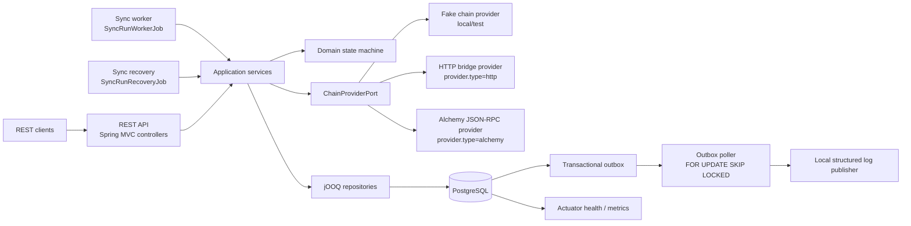

# asset-sync-service


[](https://github.com/AsyncAssassin/asset-sync-service/actions/workflows/ci.yml)
[](https://github.com/AsyncAssassin/asset-sync-service/releases)

`asset-sync-service` is a backend MVP for synchronizing public account, watched-address, and observed transaction lifecycle state. It accepts observed chain events through a REST API or the active provider sync path, applies an idempotent domain state machine, stores the result in PostgreSQL, and emits lifecycle changes through a transactional outbox with a local structured-log publisher.

## At A Glance

| Area | Current MVP |
| --- | --- |
| Runtime | Kotlin, Java 21, Spring Boot 3.x, blocking Spring MVC |
| Persistence | PostgreSQL 17, Liquibase migrations, jOOQ repositories |
| API | Versioned REST API under `/api/v1`, Spring `ProblemDetail`, OpenAPI |
| Reliability | Natural keys, PostgreSQL constraints, row locks, transactional outbox, retry/backoff |
| Observability | Actuator health/readiness/metrics/Prometheus, structured domain logs |
| Testing | Unit tests plus Testcontainers PostgreSQL integration tests |
| External systems | Docker Compose PostgreSQL; fake provider in `local`/`test`; HTTP bridge or Alchemy provider selected by `asset-sync.provider.type` elsewhere; bundled provider simulator plus seeded dataset in `demo` |

## Implemented Features

- Account creation and lookup.
- Watched address registration with chain-specific address formats, account-level address listing, and enabling or disabling an address.
- Observed event ingestion for `local-evm`.
- Asset registry: watched-address registration accepts only assets enabled for the chain in `asset_configs`, seeded with `USDC` on `local-evm` and `eth-sepolia` and a disabled `eth-mainnet` row.
- Idempotent transaction lifecycle transitions: `SEEN`, `CONFIRMED`, and `REVERTED`.
- Outbox event creation for meaningful transaction state changes.
- Manual sync by watched address or account through a page-based `ChainProviderPort` (`FakeChainProvider` in `local`/`test`, `HttpChainProvider` or `AlchemyChainProvider` elsewhere, selected by `asset-sync.provider.type`).
- Provider selection by configuration: the `alchemy` type binds its own settings, validates them and the asset registry at startup, probes every required Alchemy network with the configured credentials, and keeps the API key out of logs, errors, and health details; `eth-sepolia` is the first mapped chain.
- Alchemy ERC-20 adapter: finality-lagged range scans with a one-block fallback for dense windows, whole-block emission sorted by block and log index, a block-boundary cursor, decimal-adjusted amounts from raw base units and registry decimals, self-transfer and wrong-token skips, a per-fetch RPC and time budget, and a local rate limiter.
- Per-watched-address provider cursors, checkpoint leases, and bounded continuation requeue for large syncs.
- Sync run inspection.
- Scheduled outbox publishing to structured logs.
- Liveness, readiness, metrics, Prometheus, Swagger UI, and OpenAPI JSON.
- `demo` profile with seeded lifecycle data, HTTP Basic roles, and an in-process provider simulator behind the real HTTP adapter.

## Architecture

PostgreSQL is the source of truth for accounts, watched addresses, observed transactions, sync runs, and outbox events. Application services orchestrate use cases, the domain state machine evaluates lifecycle changes, and jOOQ repositories keep database-specific reliability behavior explicit.


```mermaid
flowchart LR
    client["REST clients"] --> api["REST API<br/>Spring MVC controllers"]
    worker["Sync worker<br/>SyncRunWorkerJob"] --> services["Application services"]
    recovery["Sync recovery<br/>SyncRunRecoveryJob"] --> services
    api --> services
    services --> state["Domain state machine"]
    services --> providerPort["ChainProviderPort"]
    providerPort --> fakeProvider["Fake chain provider<br/>local/test"]
    providerPort --> httpProvider["HTTP bridge provider<br/>provider.type=http"]
    providerPort --> alchemyProvider["Alchemy JSON-RPC provider<br/>provider.type=alchemy"]
    services --> repos["jOOQ repositories"]
    repos --> db[("PostgreSQL")]
    db --> outbox["Transactional outbox"]
    outbox --> poller["Outbox poller<br/>FOR UPDATE SKIP LOCKED"]
    poller --> publisher["Local structured log publisher"]
    db --> actuator["Actuator health / metrics"]
```

Detailed documentation:

- [Architecture](docs/architecture.md)
- [API](docs/api.md)
- [Database](docs/database.md)
- [Failure modes](docs/failure-modes.md)
- [Testing](docs/testing.md)
- [Implementation plan](docs/implementation-plan.md)
- [Changelog](CHANGELOG.md)

## Screenshots

Swagger UI shows the generated OpenAPI surface exposed by the running service.


Actuator health captures show the service and readiness endpoints returning `UP` as an anonymous caller sees them: the aggregate status without components. Authenticated callers in the protected profiles, and everyone in `local`, also see the database and chain provider components.


The outbox smoke capture shows a real observed event reaching a `PUBLISHED` outbox row.


## API And OpenAPI

When the app is running:

- Swagger UI: [http://localhost:18080/swagger-ui.html](http://localhost:18080/swagger-ui.html)
- OpenAPI JSON: [http://localhost:18080/v3/api-docs](http://localhost:18080/v3/api-docs)

The OpenAPI document declares HTTP Basic, so **Authorize** in Swagger UI takes a username and password and sends them with every call. Outside `local` and `test` both pages and every API call require them. The document covers the `/api` operations only, with the status each one answers with and the `ProblemDetail` errors they share: `400`, `401`, `500`, and `503` on every operation, and `403` on those that change state; `docs/api.md` section 14 lists the rest.

Current public endpoints:

```text
POST /api/v1/accounts
GET  /api/v1/accounts/{accountId}
POST  /api/v1/accounts/{accountId}/addresses
GET   /api/v1/accounts/{accountId}/addresses
PATCH /api/v1/addresses/{addressId}
POST  /api/v1/observed-events
POST  /api/v1/addresses/{addressId}/sync
POST  /api/v1/accounts/{accountId}/sync
GET   /api/v1/sync-runs/{id}
```

Transaction read/list endpoints are intentionally deferred and are not exposed by this MVP.

## Prerequisites

- Java 21
- Docker and Docker Compose

Gradle commands that compile the service also run `generateJooq`, which starts a temporary PostgreSQL container through Testcontainers. Generated jOOQ sources are written to `build/generated/sources/jooq/main/kotlin` and are not committed.

## Quickstart

Start PostgreSQL on an alternate host port:

```bash
ASSET_SYNC_DB_PORT=55432 docker compose up -d postgres
```

Run the app locally against that database in another terminal:

```bash
SPRING_PROFILES_ACTIVE=local ASSET_SYNC_DB_PORT=55432 SERVER_PORT=18080 ./gradlew bootRun
```

Check readiness:

```bash
curl -s http://localhost:18080/actuator/health/readiness
```

Stop containers when done:

```bash
docker compose down -v
```

## Demo Flow

The commands below assume PostgreSQL is running on `55432` and the app is running on `18080` as shown in the quickstart. They use `python3` only to extract JSON ids into shell variables; if you prefer no parser, run each `curl`, copy the returned `id`, and replace the variables manually.

External references and watched addresses are unique, so the flow starts from fresh values and can be repeated against the same database. The address is generated in upper case on purpose: the service stores EVM addresses in lower case, and the responses show the normalized form.

```bash
RUN_ID=$(date +%s)
ADDRESS="0x$(openssl rand -hex 20 | tr 'a-f' 'A-F')"
TX_HASH="0x$(openssl rand -hex 32)"
```

Create an account:

```bash
ACCOUNT_JSON=$(curl -s -X POST http://localhost:18080/api/v1/accounts \
  -H 'Content-Type: application/json' \
  -d "{\"externalRef\":\"customer-local-${RUN_ID}\"}")

printf '%s\n' "$ACCOUNT_JSON"
ACCOUNT_ID=$(printf '%s' "$ACCOUNT_JSON" | python3 -c 'import json,sys; print(json.load(sys.stdin)["id"])')
```

Register a watched address on `local-evm`:

```bash
ADDRESS_JSON=$(curl -s -X POST "http://localhost:18080/api/v1/accounts/${ACCOUNT_ID}/addresses" \
  -H 'Content-Type: application/json' \
  --data-binary @- <<EOF
{
  "chainId": "local-evm",
  "address": "${ADDRESS}",
  "asset": "USDC",
  "label": "primary settlement address"
}
EOF
)

printf '%s\n' "$ADDRESS_JSON"
ADDRESS_ID=$(printf '%s' "$ADDRESS_JSON" | python3 -c 'import json,sys; print(json.load(sys.stdin)["id"])')
```

Ingest an observed transaction event:

```bash
EVENT_JSON=$(curl -s -X POST http://localhost:18080/api/v1/observed-events \
  -H 'Content-Type: application/json' \
  --data-binary @- <<EOF
{
  "chainId": "local-evm",
  "txHash": "${TX_HASH}",
  "eventIndex": 0,
  "address": "${ADDRESS}",
  "asset": "USDC",
  "amount": "12.340000000000000000",
  "blockHeight": 9123456,
  "confirmations": 1,
  "direction": "INBOUND",
  "status": "SEEN"
}
EOF
)

printf '%s\n' "$EVENT_JSON"
```

Check health, readiness, and metrics:

```bash
curl -s http://localhost:18080/actuator/health
curl -s http://localhost:18080/actuator/health/readiness
curl -s http://localhost:18080/actuator/metrics
curl -s http://localhost:18080/actuator/metrics/asset.sync.outbox.backlog.total
curl -s http://localhost:18080/actuator/prometheus
```

Optionally trigger sync with the local/test fake provider. Sync POST is asynchronous: it returns `202 Accepted` and a `Location` for the durable `sync_run`. With no scripted fake-provider events in a normal local run, the background worker should complete the run successfully with zero provider events.

```bash
SYNC_JSON=$(curl -s -X POST "http://localhost:18080/api/v1/addresses/${ADDRESS_ID}/sync")
printf '%s\n' "$SYNC_JSON"

SYNC_ID=$(printf '%s' "$SYNC_JSON" | python3 -c 'import json,sys; print(json.load(sys.stdin)["id"])')
curl -s "http://localhost:18080/api/v1/sync-runs/${SYNC_ID}"

curl -s -X POST "http://localhost:18080/api/v1/accounts/${ACCOUNT_ID}/sync"
```

Stop local containers:

```bash
docker compose down -v
```

## Demo Profile

The `demo` profile is the fastest way to show every lifecycle stage and the real HTTP provider path without any external service. Compared with `local`:

- Security is the same protected HTTP Basic chain as production. The profile seeds two well-known users: `demo-reader` / `demo-reader-pw` (role `READ`, read-only) and `demo-operator` / `demo-operator-pw` (role `OPERATOR`, mutations and sync). They stay in the database the demo ran on, so never point `prod` at that database: `prod` refuses to start while either user exists and names the SQL that removes them.
- `HttpChainProvider` is active and points at a bundled in-process simulator under `/simulator`, so an operator sync exercises the real HTTP provider path, per-address cursor checkpoints, and outbox publishing end to end. The simulator returns one `CONFIRMED` event per watched address on the first fetch and an empty page afterwards, on every seeded chain, `eth-sepolia` included: its transaction hash is `0x` and the SHA-256 of the chain, address, and asset, synthetic but well formed. Only `demo` opens `/simulator` without credentials; the other protected profiles serve no simulator and require authentication on that path like on any other.
- `DemoDataSeeder` seeds an idempotent dataset on startup: one account and watched address, observed transactions in `SEEN`, `CONFIRMED`, and `REVERTED`, outbox rows in `NEW`, `PUBLISHED`, `FAILED`, and `DEAD`, and a stale `STARTED` sync run for the recovery job to abandon. Each outbox row is a complete lifecycle event of its transaction, and seeded rows record the source `demo:seed`. Restarts do not duplicate rows, and they do not rewrite rows seeded by an earlier version either: start from an empty database (`docker compose down -v`) to get the current dataset.
- Schedulers stay on, so the outbox poller, the sync worker, and the recovery job run live.

Start PostgreSQL as in the quickstart, then run the app with the `demo` profile. The simulator base URL follows the configured server port, so the port can be set as `SERVER_PORT`, as `--server.port`, or in an IDE run configuration; it has to be a fixed port, not `0`, and the demo does not support a servlet context path. The optional recovery delay override makes the stale-run recovery visible within seconds instead of after the default one minute:

```bash
SPRING_PROFILES_ACTIVE=demo ASSET_SYNC_DB_PORT=55432 SERVER_PORT=18080 \
ASSET_SYNC_RECOVERY_INITIAL_DELAY=20s ./gradlew bootRun
```

Seeded identifiers:

| Resource | Id |
| --- | --- |
| Account `demo-account` | `d0000000-0000-0000-0000-0000000000a1` |
| Watched address `local-evm` / `0xdemoaddr` / `USDC` | `d0000000-0000-0000-0000-0000000000b1` |
| Stale `STARTED` sync run | `d0000000-0000-0000-0000-0000000000f1` |

Walk through authentication and roles:

```bash
# Anonymous API access is rejected with 401.
curl -s -o /dev/null -w '%{http_code}\n' http://localhost:18080/api/v1/accounts/d0000000-0000-0000-0000-0000000000a1

# The reader can read.
curl -s -u demo-reader:demo-reader-pw http://localhost:18080/api/v1/accounts/d0000000-0000-0000-0000-0000000000a1

# The reader cannot mutate: 403.
curl -s -o /dev/null -w '%{http_code}\n' -u demo-reader:demo-reader-pw \
  -X POST http://localhost:18080/api/v1/addresses/d0000000-0000-0000-0000-0000000000b1/sync
```

Drive the real provider path as the operator and poll the durable run:

```bash
SYNC_JSON=$(curl -s -u demo-operator:demo-operator-pw \
  -X POST http://localhost:18080/api/v1/addresses/d0000000-0000-0000-0000-0000000000b1/sync)
printf '%s\n' "$SYNC_JSON"

SYNC_ID=$(printf '%s' "$SYNC_JSON" | python3 -c 'import json,sys; print(json.load(sys.stdin)["id"])')
curl -s -u demo-reader:demo-reader-pw "http://localhost:18080/api/v1/sync-runs/${SYNC_ID}"
```

Within a few seconds the run reports `SUCCEEDED` with `eventsSeen: 1` and `eventsChanged: 1`. A second sync of the same address completes with zero events because the durable cursor is honored.

What to watch afterwards:

- Application log lines `outbox_event_publish_succeeded` for the seeded `NEW` row (`TRANSACTION_SEEN`), the retried seeded `FAILED` row (`TRANSACTION_REVERTED`), and the new `TRANSACTION_CONFIRMED` event from the simulator, each with the chain, address, transaction hash, and source of its event. The seeded `DEAD` row stays terminal.
- The seeded stale run turns `FAILED` with an `abandoned` error once the recovery job runs: `curl -s -u demo-reader:demo-reader-pw http://localhost:18080/api/v1/sync-runs/d0000000-0000-0000-0000-0000000000f1`.
- `curl -s -u demo-reader:demo-reader-pw http://localhost:18080/actuator/metrics/asset.sync.outbox.dead.total` reports the terminal row. `/actuator/prometheus` and Swagger UI require the same credentials; health probes stay open.

The same profile runs under Docker Compose by overriding the profile variable:

```bash
./gradlew clean bootJar
SPRING_PROFILES_ACTIVE=demo ASSET_SYNC_DB_PORT=55433 ASSET_SYNC_HTTP_PORT=18081 docker compose up --build -d
```

## Full Docker Compose Run

Build the application jar first. This keeps jOOQ generation and its Testcontainers PostgreSQL dependency on the host, while the Docker image only packages the resulting Spring Boot jar.

```bash
./gradlew clean bootJar
```

Build and start PostgreSQL plus the application on alternate host ports:

```bash
ASSET_SYNC_DB_PORT=55433 ASSET_SYNC_HTTP_PORT=18081 docker compose up --build -d
```

Check the app:

```bash
curl -s http://localhost:18081/actuator/health
```

Compose publishes the API and PostgreSQL on `127.0.0.1` only, because the default `local` profile has no authentication and the database password is a well-known default. To reach the API from another machine, for example during a remote demo, set `ASSET_SYNC_HTTP_BIND_ADDRESS=0.0.0.0` together with a protected profile, never with `local`. The `demo` users have public passwords, so expose `demo` on a trusted network only. PostgreSQL stays on loopback either way. Started on the host, as with `./gradlew bootRun`, `local` and `demo` listen on `127.0.0.1` too; `SERVER_ADDRESS=0.0.0.0` opens `demo` under the same conditions, on IPv6 as well as IPv4. Compose sets `SERVER_ADDRESS=0.0.0.0` inside the container, so the published port is the one gate; a container you run yourself with `local` or `demo` needs the same, published on loopback. An empty `SERVER_ADDRESS` would bind every interface, so `local` and `demo` refuse to start with one. `demo` calls its simulator on `127.0.0.1`; with `SERVER_ADDRESS` set to one other interface, point `ASSET_SYNC_PROVIDER_BASE_URL` at that interface.

```bash
SPRING_PROFILES_ACTIVE=demo ASSET_SYNC_HTTP_BIND_ADDRESS=0.0.0.0 ASSET_SYNC_DB_PORT=55433 ASSET_SYNC_HTTP_PORT=18081 \
docker compose up --build -d
```

The application container has a 40-second stop grace period, longer than the 30-second graceful-shutdown phase, so `docker compose stop` lets in-flight sync runs finish or requeue before Docker kills the process.

Stop containers:

```bash
docker compose down -v
```

## Configuration

Database configuration for the `local` profile:

| Variable | Default | Purpose |
| --- | --- | --- |
| `ASSET_SYNC_DB_HOST` | `localhost` | PostgreSQL host |
| `ASSET_SYNC_DB_PORT` | `5432` | PostgreSQL port |
| `ASSET_SYNC_DB_NAME` | `asset_sync` | Database name |
| `ASSET_SYNC_DB_USER` | `asset_sync` | Database user |
| `ASSET_SYNC_DB_PASSWORD` | `asset_sync` | Database password |
| `ASSET_SYNC_DB_MAX_POOL_SIZE` | `10` | Hikari max pool size |
| `ASSET_SYNC_DB_MIN_IDLE` | `1` | Hikari minimum idle connections |

The `prod` profile takes the datasource only from `ASSET_SYNC_DB_URL`, `ASSET_SYNC_DB_USER`, and `ASSET_SYNC_DB_PASSWORD`, with no defaults, and provisions its operator account from `ASSET_SYNC_ADMIN_USERNAME` and `ASSET_SYNC_ADMIN_PASSWORD`. It refuses to start on a database whose user store holds the `demo` users, and so does every other profile with authentication except `demo` itself, including a start without any profile. `demo`, `local`, and `test` each run alone: combined with another profile, such as `prod,demo` or `staging,local`, the process stops before the application context exists and names the profiles. The operator account cannot take a `demo` user name.

Runtime configuration:

| Variable | Default | Purpose |
| --- | --- | --- |
| `SERVER_PORT` | `8080` | HTTP port used by the Spring Boot app |
| `SERVER_ADDRESS` | `127.0.0.1` in `local` and `demo`, all interfaces elsewhere | Interface the HTTP server listens on. On a host, `0.0.0.0` opens `demo` to a trusted network and must never open `local`; inside a container published on loopback, as compose does, `0.0.0.0` is required |
| `ASSET_SYNC_OUTBOX_BATCH_SIZE` | `50` | Due outbox rows claimed per poll |
| `ASSET_SYNC_OUTBOX_RETRY_BACKOFF_BASE_DELAY` | `30s` | Retry backoff base delay |
| `ASSET_SYNC_OUTBOX_RETRY_BACKOFF_MAX_DELAY` | `15m` | Maximum retry backoff delay |
| `ASSET_SYNC_OUTBOX_PROCESSING_LEASE` | `5m` | Outbox processing lease stored in `next_attempt_at` |
| `ASSET_SYNC_OUTBOX_MAX_ATTEMPTS` | `10` | Attempts before an outbox row becomes `DEAD` |
| `ASSET_SYNC_OUTBOX_MAX_ERROR_LENGTH` | `1024` | Stored publisher error limit |
| `ASSET_SYNC_OUTBOX_SCHEDULER_ENABLED` | `true` | Enables the scheduled outbox poller |
| `ASSET_SYNC_OUTBOX_SCHEDULER_FIXED_DELAY` | `5s` | Delay between poller runs |
| `ASSET_SYNC_OUTBOX_SCHEDULER_INITIAL_DELAY` | `10s` | Initial delay before first poll |
| `ASSET_SYNC_OUTBOX_RETENTION_ENABLED` | `false` | Enables published outbox retention |
| `ASSET_SYNC_SYNC_PROVIDER_TIMEOUT` | `10s` | Provider page fetch deadline |
| `ASSET_SYNC_SYNC_PROVIDER_MAX_THREADS` | `4` | Provider fetch isolation pool size |
| `ASSET_SYNC_PAGINATION_PAGE_SIZE` | `100` | Provider page event limit |
| `ASSET_SYNC_PAGINATION_MAX_PAGES_PER_ADDRESS_RUN` | `50` | Per-claim page bound for one address |
| `ASSET_SYNC_PAGINATION_MAX_EVENTS_PER_ADDRESS_RUN` | `5000` | Per-claim event bound for one address |
| `ASSET_SYNC_PAGINATION_MAX_PAGES_PER_ACCOUNT_RUN` | `200` | Per-claim page bound for account sync |
| `ASSET_SYNC_PAGINATION_MAX_EVENTS_PER_ACCOUNT_RUN` | `20000` | Per-claim event bound for account sync |
| `ASSET_SYNC_PAGINATION_MAX_RUN_DURATION` | `2m` | Per-claim sync duration bound checked between pages |
| `ASSET_SYNC_PAGINATION_CURSOR_LEASE_DURATION` | `2m` | Per-address cursor lease duration |
| `ASSET_SYNC_PAGINATION_CURSOR_HEARTBEAT_INTERVAL` | `30s` | Cursor lease extension cadence during page work |
| `ASSET_SYNC_PAGINATION_MAX_PROVIDER_PAGE_BYTES` | `1048576` | HTTP provider response byte cap before JSON parse |
| `ASSET_SYNC_PAGINATION_MAX_CONTINUATIONS_PER_RUN` | `1000` | Healthy continuation requeue limit |
| `ASSET_SYNC_WORKER_ENABLED` | `true` | Enables the scheduled async sync worker |
| `ASSET_SYNC_WORKER_CLAIM_BATCH_SIZE` | `10` | Due sync runs claimed per worker tick |
| `ASSET_SYNC_WORKER_MAX_CONCURRENCY` | `4` | Local worker job concurrency; must be `<= ASSET_SYNC_SYNC_PROVIDER_MAX_THREADS` |
| `ASSET_SYNC_WORKER_LEASE_DURATION` | `60s` | Lease duration for `RUNNING` sync runs |
| `ASSET_SYNC_WORKER_HEARTBEAT_INTERVAL` | `20s` | Heartbeat cadence while a worker owns a run |
| `ASSET_SYNC_WORKER_MAX_ATTEMPTS` | `5` | Retryable failure attempts before sync becomes terminal `FAILED` |
| `ASSET_SYNC_WORKER_MAX_IN_FLIGHT_RUNS` | `1000` | Soft cap for `QUEUED + RUNNING` sync runs |
| `ASSET_SYNC_WORKER_SHUTDOWN_TIMEOUT` | `20s` | How long a shutdown waits for in-flight sync runs before interrupting them |
| `ASSET_SYNC_SHUTDOWN_PHASE_TIMEOUT` | `30s` | Upper bound for one graceful-shutdown phase; the web server and the sync worker drain concurrently within it |
| `ASSET_SYNC_WORKER_FIXED_DELAY` | `5s` | Delay between worker claim ticks; also the `Retry-After` of a `429 sync-queue-full` response |
| `ASSET_SYNC_WORKER_INITIAL_DELAY` | `10s` | Initial delay before the first worker claim |
| `ASSET_SYNC_WORKER_RETRY_BACKOFF_BASE_DELAY` | `30s` | Base delay of the jittered retry backoff for failed sync runs |
| `ASSET_SYNC_WORKER_RETRY_BACKOFF_MAX_DELAY` | `15m` | Maximum retry backoff; also caps a provider `Retry-After` |
| `ASSET_SYNC_WORKER_MAX_ERROR_LENGTH` | `1024` | Stored sync run error limit |
| `ASSET_SYNC_ACCOUNT_SYNC_BATCH_SIZE` | `100` | Watched addresses loaded per batch while an account sync traverses its addresses |
| `ASSET_SYNC_MAX_ACCOUNT_SYNC_ADDRESSES` | `1000` | Maximum watched addresses an account sync may traverse |
| `ASSET_SYNC_STALE_RUN_TIMEOUT` | `30m` | Age after which the recovery job abandons a legacy `STARTED` sync run |
| `ASSET_SYNC_PAGINATION_CURSOR_LEASE_RETRY_DELAY` | `5s` | Requeue delay when an address's cursor lease is busy |
| `ASSET_SYNC_PAGINATION_CONTINUATION_REQUEUE_DELAY` | `1s` | Requeue delay for a healthy continuation |
| `ASSET_SYNC_PAGINATION_MAX_CURSOR_LENGTH` | `4096` | Longest provider cursor accepted in a page |
| `ASSET_SYNC_PAGINATION_MAX_CHECKPOINT_JSON_LENGTH` | `16384` | Largest page checkpoint metadata accepted, in bytes |
| `ASSET_SYNC_RECOVERY_ENABLED` | `true` | Enables the recovery job for expired leases and stale runs |
| `ASSET_SYNC_RECOVERY_BATCH_SIZE` | `100` | Rows handled per recovery tick |
| `ASSET_SYNC_RECOVERY_FIXED_DELAY` | `1m` | Delay between recovery ticks; a run left `RUNNING` by a crashed worker is requeued on the first tick after its lease expires |
| `ASSET_SYNC_RECOVERY_INITIAL_DELAY` | `1m` | Initial delay before the first recovery tick |
| `ASSET_SYNC_OUTBOX_PUBLISHED_RETENTION` | `7d` | Age after which published outbox rows are deleted when retention is enabled |
| `ASSET_SYNC_OUTBOX_RETENTION_BATCH_SIZE` | `1000` | Published rows deleted per retention tick |
| `ASSET_SYNC_OUTBOX_RETENTION_FIXED_DELAY` | `1h` | Delay between retention ticks |
| `ASSET_SYNC_OUTBOX_RETENTION_INITIAL_DELAY` | `5m` | Initial delay before the first retention tick |

### Chain Provider

`asset-sync.provider.type` selects the `ChainProviderPort` implementation for every profile except `local` and `test`, which always use the fake provider. Each provider type has its own beans behind one shared condition, so an `http` deployment never binds or validates Alchemy settings and an `alchemy` deployment never needs the HTTP bridge endpoint.

| Variable | Default | Purpose |
| --- | --- | --- |
| `ASSET_SYNC_PROVIDER_TYPE` | `http` | `http` for the normalized HTTP bridge (the simulator in `demo`, an indexer in `prod`), `alchemy` for Alchemy JSON-RPC |
| `ASSET_SYNC_PROVIDER_BASE_URL` | none in `prod` | HTTP bridge endpoint; required when the type is `http`, ignored for `alchemy`. A user name or password in the URL stops startup, because the HTTP client never sends them; the bridge credential goes in a header instead. The bridge page contract is in `docs/architecture.md` |
| `ASSET_SYNC_PROVIDER_AUTH_HEADER_NAME` | `Authorization` | Header that carries the bridge credential, such as `X-API-Key` |
| `ASSET_SYNC_PROVIDER_AUTH_HEADER_VALUE` | none | Bridge credential, such as `Bearer <token>`, sent on every bridge request when set. A secret: keep it in the environment; no log line, error, or health detail quotes it |
| `ASSET_SYNC_PROVIDER_CONNECT_TIMEOUT` | `2s` | Connect timeout for provider HTTP requests |
| `ASSET_SYNC_PROVIDER_READ_TIMEOUT` | `5s` | Read timeout for provider HTTP requests |
| `ASSET_SYNC_PROVIDER_ALCHEMY_API_KEY` | none | Alchemy API key; required for `alchemy`, never logged or shown in health or error details |
| `ASSET_SYNC_PROVIDER_ALCHEMY_AUTH_MODE` | `header` | `header` sends `Authorization: Bearer`; `path` embeds the key in the URL and exists only for compatibility |
| `ASSET_SYNC_PROVIDER_ALCHEMY_ENDPOINT_TEMPLATE` | `https://{network}.g.alchemy.com/v2/` | Header-mode endpoint; `{network}` is replaced per chain |
| `ASSET_SYNC_PROVIDER_ALCHEMY_PATH_ENDPOINT_TEMPLATE` | `https://{network}.g.alchemy.com/v2/{apiKey}` | Path-mode endpoint |
| `ASSET_SYNC_PROVIDER_ALCHEMY_START_MODE` | `registration-safe` | `registration-safe` starts a new watched address at the safe block of its first sync; `configured-block` starts at the per-chain start block |
| `ASSET_SYNC_PROVIDER_ALCHEMY_ETH_SEPOLIA_START_BLOCK` | none | Start block for `eth-sepolia`; required only with `configured-block` |
| `ASSET_SYNC_PROVIDER_ALCHEMY_FINALITY_MODE` | `safe` | `safe`, `finalized`, or `depth` |
| `ASSET_SYNC_PROVIDER_ALCHEMY_FINALITY_DEPTH_FALLBACK` | `64` | Blocks behind the latest block used by `depth` mode or as the fallback |
| `ASSET_SYNC_PROVIDER_ALCHEMY_MAX_WINDOW_BLOCKS` | `5000` | Candidate blocks one page fetch may scan |
| `ASSET_SYNC_PROVIDER_ALCHEMY_MAX_RPC_CALLS_PER_FETCH` | `8` | JSON-RPC calls per page fetch; startup rejects values below `4`, and narrowing a paged window needs four spare calls |
| `ASSET_SYNC_PROVIDER_ALCHEMY_RATE_LIMIT_CAPACITY` | `6` | Local token bucket burst |
| `ASSET_SYNC_PROVIDER_ALCHEMY_RATE_LIMIT_REFILL_PER_SECOND` | `3.0` | Local token bucket refill rate |

The chain-to-network mapping lives under `asset-sync.provider.alchemy.networks` in `application.yml`; `eth-sepolia` is the first and only mapped chain. Map keys contain dashes, so further chains are added in YAML or through `SPRING_APPLICATION_JSON`, not through environment variables. `max-window-blocks` bounds the block range of one page fetch, `max-rpc-calls-per-fetch` bounds its JSON-RPC calls, and the rate-limit settings size the local token bucket in front of every call.

With `type=alchemy` the service validates the configuration and the registry before the sync worker starts: the key must be set, every enabled chain with enabled asset configs and active watched addresses must map to a network, every mapped network gets an `eth_blockNumber` probe with the configured credentials, and no active watched address may lack an enabled asset config. A violation, or a probe that Alchemy rejects (`401`, `403`, JSON-RPC `-32600`, or an answer that is not a block number) or answers with a redirect, stops the process with a `ProviderConfigurationException` whose message names the chains or `(chain_id, asset)` pairs and the operator action, never the key. A probe that meets an outage (`5xx`, `429`, a timeout, a transport error) does not: the service starts with the `alchemyChainProvider` health component `DOWN` in the `probe-failed` state, while the REST API and outbox publishing keep working. Sync runs retry with backoff up to `asset-sync.sync.worker.max-attempts`, five by default and about seven and a half minutes, and then fail; nothing probes again, so the first successful fetch clears the state. An enabled chain without a mapping and without active watched addresses is only logged as `alchemy_preflight_unmapped_chains_skipped`, so a fresh database boots as is, although the seeded `local-evm` chain has no Alchemy network. Registering an address on such a chain, or enabling one again, answers `404 Unsupported chain`. An address registered there before the switch to Alchemy fails its syncs terminally and stops the next start until the address or the chain is disabled. A disabled chain lets the service start, but its active addresses still fail every sync, so disable them as well; to rule both out, disable the chain and its addresses before the rollout:

```sql
UPDATE chain_configs SET enabled = false WHERE chain_id = 'local-evm';
UPDATE watched_addresses SET status = 'DISABLED', updated_at = now() WHERE chain_id = 'local-evm' AND status = 'ACTIVE';
```

The same rules hold for changes made while the service runs. An address whose asset config is disabled then fails only its own syncs, with provider health `UP` and the reason in the run's `last_error`, but the next start refuses it until the address is disabled or the config is enabled again.

A page fetch under `alchemy` asks for the latest block and the finality frontier (the `safe` or `finalized` tag, or latest minus `finality-depth-fallback` in `depth` mode or when the tag is unavailable), then scans from the cursor's next block up to the frontier, at most `max-window-blocks` per fetch, with one `alchemy_getAssetTransfers` call per direction for the whole range. A range answered without `pageKey` is complete for every block in it, so quiet stretches cost two calls; a range that comes back paged is narrowed to the blocks before its page boundary and re-queried, and the boundary block is drained alone (`fromBlock == toBlock`) with `pageKey` followed only in memory. Events are emitted for whole blocks only, sorted by block and log index, with amounts converted from `rawContract.value` and the registry decimals; self-transfers and rows of another contract are skipped and counted in the checkpoint. The cursor is always a block boundary (`{"v":1,"p":"alchemy","nextBlock":N}`), a new watched address starts just above the frontier under `registration-safe` and at the configured block under `configured-block`, and a block that cannot be finished within the RPC and time budget is retried from the same cursor. One block holding more events for the watched address than `asset-sync.sync.pagination.page-size` is a terminal configuration error, because the page contract cannot split a block. `docs/alchemy-runbook.md` covers getting and rotating a key, the Sepolia rollout, the env-gated live smoke, what to inspect, and the failure actions.

Every block is read once, which sets two limits. Under `registration-safe` the start block is fixed by an address's first sync, not by its registration: that sync starts just above the finality frontier of that moment and ingests nothing, so a transfer made between registration and the first sync that is already below the frontier by then is never ingested. Sync a new address right after registering it, and use `configured-block` with a block shortly before the first transfer for a demo or a backfill. An event also keeps the confirmations it had when its block was scanned, at least `latest - frontier + 1` (`finality-depth-fallback + 1` in `depth` mode), so a `required_confirmations` above that on an Alchemy chain leaves its events `SEEN`. The seeded thresholds, 1 for `eth-sepolia` and 12 for the disabled `eth-mainnet`, stay below the usual depth of the `safe` block on Ethereum and below the default `finality-depth-fallback` of 64.

## Reliability Highlights

- Natural idempotency keys: watched addresses use `chainId + address + asset`; observed transactions use `chainId + txHash + eventIndex + address + asset`.
- PostgreSQL constraints enforce uniqueness, enum-like values, non-negative amounts/counts, and foreign keys.
- Every observed transaction and outbox event records its source, `rest:<user>` for the API or `provider:<type>` for a sync (`demo:seed` for the `demo` dataset), so a status reported through the API stays distinguishable from provider data.
- Ingestion rejects what PostgreSQL would round or refuse: amounts must fit `numeric(38, 18)`, exponent notation included, and are stored at scale 18; addresses and transaction hashes must be well formed for their chain (`0x` hex on `eth-sepolia` and `eth-mainnet`, no whitespace, `/`, or `:` on `local-evm`, no control characters anywhere); a provider page is checked in full before its first event is written.
- Observed transaction ingestion locks existing rows with row-level `FOR UPDATE` before evaluating transitions.
- jOOQ uses `INSERT ... ON CONFLICT` for idempotent observed-transaction and outbox writes.
- Transactional outbox rows are inserted in the same database transaction as lifecycle state changes.
- The outbox poller claims due rows with `FOR UPDATE SKIP LOCKED`, writes a lease to `next_attempt_at`, then completes each event with a fenced compare-and-set update.
- Sync POST enqueues durable `sync_runs` and returns `202 Accepted`; the scheduled worker claims `QUEUED` runs with `FOR UPDATE SKIP LOCKED`, heartbeats `RUNNING` leases, and completes with `locked_by + lock_token` fencing.
- Provider sync is page-based. Each watched address has a `sync_cursors` row; the worker acquires a cursor lease, fetches one bounded page, ingests the full page, and only then advances the checkpoint.
- Healthy page/account continuations increment `continuation_count`, while retryable failures and 429 backpressure increment `failure_attempts`.
- Duplicate in-flight sync requests for the same address/account return the existing run instead of starting duplicate provider work.
- Account sync keeps its pass over the addresses in the run checkpoint, a keyset over `(created_at, id)`, so an account larger than one claim completes instead of starting over. A busy address is revisited after the scan, and an address that fails terminally ends only itself: the others still sync and the run finishes `FAILED` with the failed addresses in `lastError`. `PATCH /api/v1/addresses/{addressId}` with `{"status":"DISABLED"}` takes such an address out of account syncs.
- Graceful shutdown stops claiming, drains in-flight sync runs up to the worker shutdown timeout, and requeues any run interrupted afterwards without consuming its retry budget.
- Publishing is at-least-once; downstream consumers should deduplicate by event id or idempotency key.
- Failed publishes store a bounded error message, use bounded retry backoff, and become terminal `DEAD` rows at max attempts.
- A publish that succeeds but cannot be marked `PUBLISHED` is treated as a completion failure, not a publish failure: attempts are not incremented and the leased row is retried after the lease expires.

## Observability

- Actuator endpoints: `/actuator/health`, `/actuator/health/liveness`, `/actuator/health/readiness`, `/actuator/info`, `/actuator/metrics`, and `/actuator/prometheus`.
- Readiness includes PostgreSQL connectivity.
- `/actuator/info` reports the build name and version generated by the Gradle build.
- Health component details (database, chain provider) are shown to authenticated callers in protected profiles and to everyone in `local`; anonymous probes see only the aggregate status. The disk-space indicator is off, because its details reveal the working directory's absolute path.
- Provider health indicator follows the selected provider: fake in `local`/`test`, HTTP bridge or Alchemy elsewhere; the Alchemy indicator shows the auth mode, the probed networks, and the state, never an endpoint or the key, and the bridge indicator names the kind of a transport failure, never the bridge URL. Only availability failures (timeouts, transport errors, `5xx`, `429`, or an outage during the Alchemy startup probe as `probe-failed`) and configuration failures (rejected credentials, a redirect) turn it `DOWN`; invalid data for one address stays `UP` with a `lastDataError` detail.
- Structured logs include account, watched-address, transaction, sync-run, provider, and outbox identifiers.
- Micrometer meters cover observed event ingestion, transaction transitions, immutable conflicts, sync runs and continuations, provider fetches, latency and pages, cursor leases and checkpoints, outbox batches, events, backlog, dead-letter count, scheduler tick failures, and the Alchemy adapter's JSON-RPC calls, latency, one-block fallbacks, and skipped rows.
- `local` and `test` profiles permit all endpoints. Other profiles enable HTTP Basic for API, Swagger, and Actuator endpoints except health probes; their `401` and `403` responses use the same `ProblemDetail` format as API errors, and `401` keeps the `WWW-Authenticate: Basic` challenge. While PostgreSQL is unavailable, a request with credentials gets the API's `503 database-unavailable` without a challenge, because the credentials cannot be checked (`docs/failure-modes.md` section 6). A request that the security firewall rejects before authentication, for example one with `//` or `;` in its path, gets `400` in every profile, not a challenge. The API keeps no session, so CSRF protection is off; a browser that caches Basic credentials could still be made to post to the two body-less sync endpoints, which only queues extra sync runs. Keep browsers you use for other sites logged out of the API and put the service behind a gateway when it is exposed.

## Testing

Coverage highlights:

- Unit tests for the Spring-independent domain state machine.
- Testcontainers PostgreSQL integration tests for jOOQ repositories and transactional behavior.
- Liquibase migration tests.
- API tests for controllers, DTO validation, and `ProblemDetail` responses.
- Outbox retry and concurrency tests, including `FOR UPDATE SKIP LOCKED`.
- Observability tests for health and metrics.
- Alchemy adapter contract tests and worker integration tests against a scripted JSON-RPC stub, including secret scrubbing down to `sync_runs.last_error`.
- An env-gated live smoke against Alchemy Sepolia (`ALCHEMY_LIVE_SMOKE=true`, see `docs/alchemy-runbook.md`) that CI skips.
- GitHub Actions CI runs Gradle checks, `bootJar`, a Trivy scan of the Docker image that fails on HIGH and CRITICAL vulnerabilities with a fix, `docker compose config`, and a generated jOOQ tracking guard. The workflow token is read-only, actions are pinned to commit SHAs, and the Gradle wrapper verifies the distribution checksum.
- Dependabot proposes weekly Gradle, GitHub Actions, and Docker base image updates within Java 21 as pull requests that run the same CI. Spring Boot 3.5 gets no more open-source releases, so `build.gradle.kts` pins patched Jackson, Tomcat, pgjdbc, Log4j API, and commons-lang3 versions over its BOM; those pins are maintained by hand.

Verification commands:

```bash
./gradlew clean test
./gradlew clean check
./gradlew clean bootJar
docker compose config
```

## Gradle Tasks

```bash
./gradlew test
./gradlew check
SPRING_PROFILES_ACTIVE=local ./gradlew bootRun
./gradlew generateJooq
```

## MVP Boundaries

This service does not provide custody, signing, private key storage, wallet functionality, or real funds movement. The MVP includes basic non-local HTTP Basic protection, a Prometheus scrape endpoint, and HTTP bridge and Alchemy provider adapters, but it does not bundle a blockchain node or indexer of its own, Kafka, SQS, Redis, balance projection, tenant-level authorization, CD/deployment automation, or release automation.

### Known Limitations

- `REVERTED` is final. A transaction that a reorg reverted stays `REVERTED` even if the chain includes it again; a later event for it is a duplicate or a conflict. Nothing tracks reorgs automatically: `REVERTED` arrives only through `POST /api/v1/observed-events`, and the Alchemy adapter scans only up to the finality frontier, where reorgs are practically excluded.
- No tenant isolation. The `READ` and `OPERATOR` roles are global: every `READ` user sees every account, and every `OPERATOR` user can change any account's addresses and report events on any chain.
- Watched addresses are unique per `(chain_id, address, asset)` across all accounts, so registering an address that another account already watches returns `409` and tells the caller that someone watches it. Without tenant isolation this reveals nothing new; the rule is to be revisited together with isolation.
- Basic authentication verifies the BCrypt hash on every request (about 70 ms of CPU), and nothing limits failed attempts: expose the service only behind a gateway that rate-limits requests.
- Users are cached for a minute, so a password changed or a user removed directly in the `users` table takes effect within a minute. During a database outage a user seen in the last ten minutes stays accepted, which keeps the metrics reachable.
- The Alchemy rate limiter is local to each process. Instances that share one key send up to their number times the configured rate, and every `429` spends a retry attempt of the run, so run one instance per key or split the rate between them.
- `sync_runs` has no retention: every sync request adds a row. `docs/database.md` has the SQL that deletes old finished runs.
- The outbox publishes to the structured log only, at least once; there is no external broker, and consumers deduplicate by event id or idempotency key.
- Self-transfers are not recorded. The Alchemy adapter skips a transfer from the watched address to itself, because it moves no funds, and only counts it: `skippedSelfTransfers` in the cursor checkpoint of that fetch and `asset.sync.provider.alchemy.skipped.rows` with the reason `SELF_TRANSFER`.

## Roadmap / Deferred Scope

Future extensions, not implemented yet:

- Transaction read/list endpoints.
- Provider coverage beyond Alchemy ERC-20 transfers and the generic HTTP page contract: native and internal transfers, ERC-721/1155, and a second provider on the same asset registry.
- External broker adapter for the outbox.
- Balance projection read models.
- Tenant-level authorization and account ownership.
- CD, deployment automation, and release automation.

## Repository Layout

```text
.
  Dockerfile
  docker-compose.yml
  build.gradle.kts
  settings.gradle.kts
  docs/
  src/jooqCodegen/
  src/main/kotlin/com/example/assetsync/
  src/main/resources/
  src/test/kotlin/com/example/assetsync/
  src/test/resources/
```
