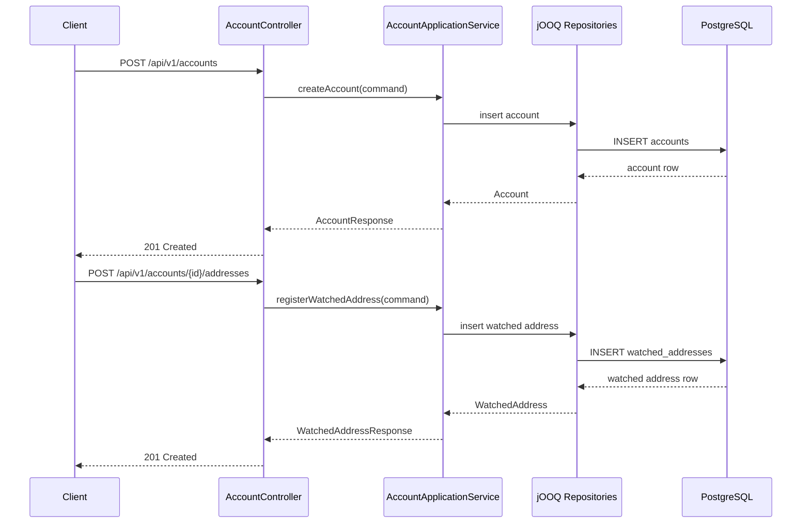
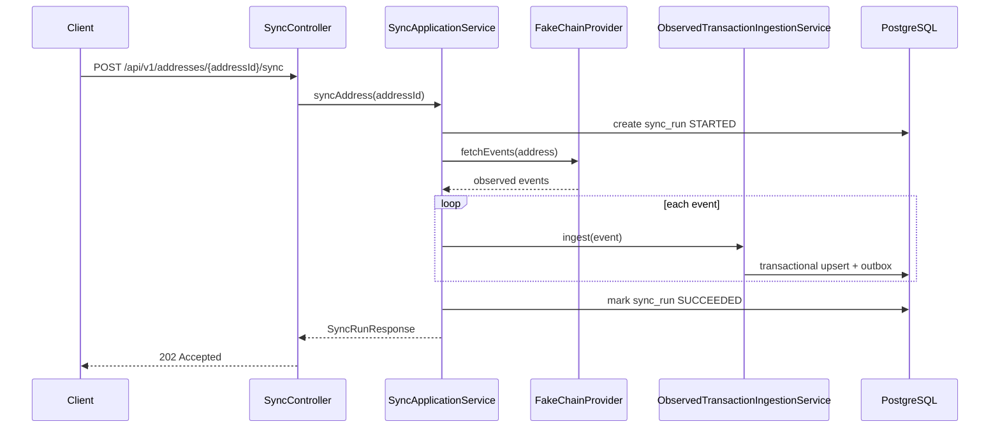
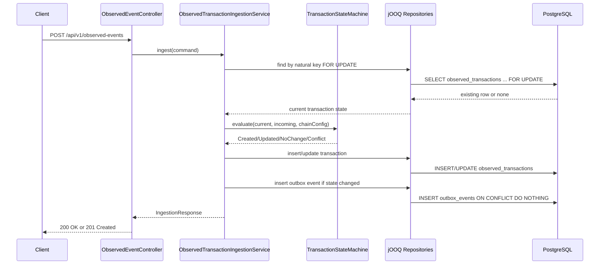
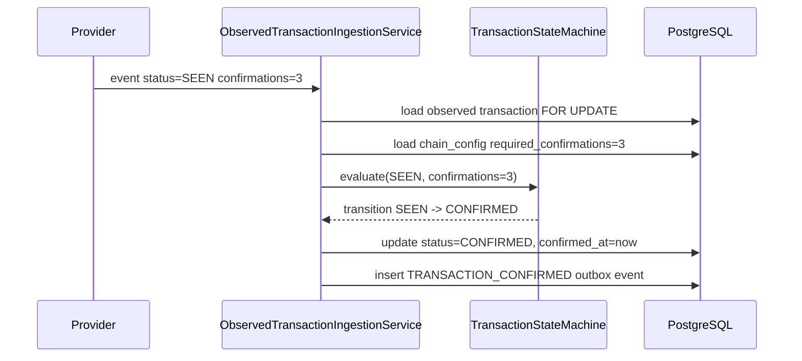
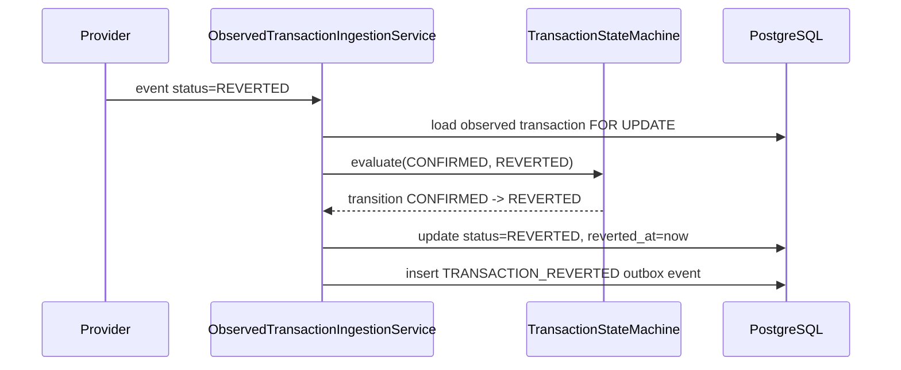
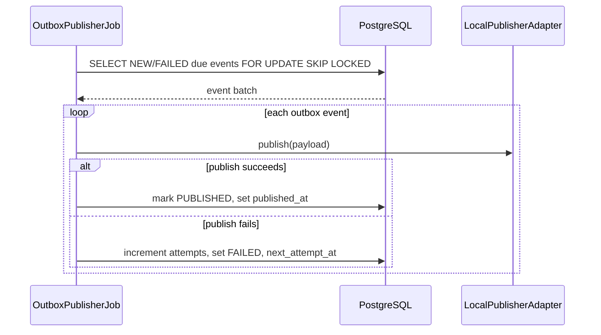
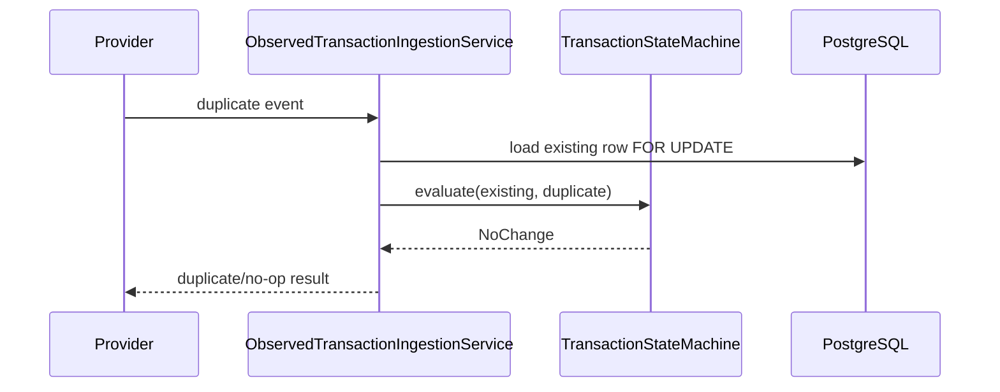

# asset-sync-service Architecture

Status: MVP implemented through Phase 10  
Scope: MVP backend service  
Stack: Kotlin, Spring Boot 3.x, Spring MVC, jOOQ, PostgreSQL, Liquibase, Testcontainers, Docker Compose, OpenAPI, transactional outbox  
Last updated: 2026-06-20

## 1. Assumptions

- `eventIndex` is required and represents the provider-specific event discriminator inside a transaction. It covers log indexes, output indexes, or similar chain-specific positions.
- `asset` is represented as a string asset id or symbol in the MVP.
- A watched address is unique by `chainId + address + asset`.
- The chain provider is fake, in-memory, or an HTTP stub in the MVP.
- PostgreSQL is the source of truth for accounts, watched addresses, observed transactions, sync runs, and outbox events.
- The outbox publisher writes to a local publishing adapter or structured logs in the MVP.
- Balance projection is not part of the first MVP.
- External event delivery is at-least-once. Downstream consumers must be idempotent.

## 2. Non-Goals

- No real blockchain node integration in the MVP.
- No private key, seed phrase, or signing material handling.
- No transaction signing.
- No custody functionality.
- No real funds movement.
- No balance projection in the MVP.
- No Kafka or SQS publisher in the MVP.
- No Redis dependency in the MVP.
- No WebFlux or coroutines in the MVP unless a later requirement justifies them.

## 3. Project Description

`asset-sync-service` is a backend service that synchronizes public account, address, and asset state from observable transaction events. It tracks public facts such as `chainId`, `address`, `asset`, `txHash`, `eventIndex`, `amount`, `blockHeight`, `confirmations`, `direction`, and `status`. The service does not store private keys, sign transactions, provide wallet functionality, or move funds. It accepts events directly through an API or obtains them from a fake chain provider during sync. Events are processed through an idempotent state machine and persisted in PostgreSQL. Meaningful transaction state changes create transactional outbox events in the same database transaction.

## 4. Main Use Cases

- Create an account.
- Register a watched address for an account.
- Start sync by watched address.
- Start sync by account.
- Ingest an observed transaction event.
- Process duplicate events idempotently.
- Update confirmations and transition transactions to `CONFIRMED`.
- Simulate a reorg and transition transactions to `REVERTED`.
- Create outbox events for meaningful transaction state changes.
- Publish outbox events through a scheduled poller.
- Inspect sync runs. Transaction listing/read APIs are deferred beyond the current MVP implementation.

## 5. High-Level Architecture

The service is a blocking Spring MVC application. The main database is PostgreSQL. Schema evolution is managed by Liquibase. Persistence access uses jOOQ.

```text
REST API / Scheduler
        |
        v
Application Services
        |
        +--> ChainProviderPort -> Fake Chain Provider
        |
        +--> Domain State Machine
        |
        v
jOOQ Repositories
        |
        v
PostgreSQL
        |
        v
Outbox Publisher Poller
```

### Layers

API layer:
- Exposes versioned REST endpoints.
- Owns request/response DTOs.
- Performs request validation.
- Maps domain/application errors to `ProblemDetail` responses.
- Does not use jOOQ directly.

Application layer:
- Owns use-case orchestration.
- Defines transaction boundaries.
- Calls provider ports, domain policies, and repositories.
- Coordinates observed event ingestion, sync lifecycle, and outbox creation.

Domain layer:
- Contains Spring-independent state transition logic.
- Defines domain enums, value objects, transition results, and policies.
- Does not depend on persistence, HTTP, or scheduling concerns.

Infrastructure layer:
- Implements repositories with jOOQ.
- Implements the fake chain provider.
- Implements the outbox publisher adapter.
- Configures Liquibase, OpenAPI, metrics, logging, and health checks.

### Why jOOQ Instead of Spring Data JPA

jOOQ is the primary persistence choice for the MVP because the core behavior depends on database-native reliability primitives:

- `INSERT ... ON CONFLICT` for idempotent upserts.
- Row-level locking for concurrent event processing.
- `FOR UPDATE SKIP LOCKED` for outbox polling.
- JSONB outbox payloads.
- Explicit constraints and indexes.
- Clear SQL for state transitions and conflict handling.

Spring Data JPA is viable for simpler CRUD-heavy services, but this service is centered on database constraints, idempotency, and transactional edge cases. With JPA, the critical parts would likely become native SQL anyway. jOOQ keeps the database behavior explicit while still integrating cleanly with Spring transactions.

## 6. Sequence Flows

### Account And Watched Address Registration



### Manual Address Sync



The provider call is outside the observed event ingestion transaction. A provider timeout must not hold database locks.

### Observed Event Ingestion



### Confirmations Update To CONFIRMED



### Reorg To REVERTED



### Outbox Poller Publishing



### Duplicate Event No-Op Path



No outbox event is created on no-op duplicate processing.

## 7. Kotlin/Spring Package Structure

```text
com.example.assetsync
  api
    controller
    dto
    error
  application
    account
    sync
    transaction
    outbox
  domain
    model
    policy
    state
  infrastructure
    persistence
    provider
    outbox
    observability
  config
```

Package rules:

- Controllers do not know jOOQ.
- Repositories do not accept API DTOs.
- The domain state machine is Spring-independent.
- Application services depend on ports and repositories, not concrete HTTP or database details.
- Infrastructure implements outbound ports.
- API DTOs are mapped into application commands.

## 8. Domain Model And State Machines

### Entities And Concepts

Account:
- Logical grouping for watched addresses.
- Does not imply custody or signing capability.

WatchedAddress:
- Public address registered for observation.
- Belongs to an account.
- Scoped by `chainId`, `address`, and `asset`.

ObservedTransaction:
- Canonical stored representation of an observed transaction event for a watched address and asset.
- Identified idempotently by `chainId + txHash + eventIndex + address + asset`.

ChainConfig:
- Per-chain configuration.
- Contains the confirmation threshold used by the state machine.

OutboxEvent:
- Durable integration event created inside the same database transaction as the observed transaction change.

SyncRun:
- Diagnostic record for manual or scheduled sync execution.
- Not a source of truth for transaction state.

### Enums

`TransactionStatus`:
- `SEEN`
- `CONFIRMED`
- `REVERTED`

`Direction`:
- `INBOUND`
- `OUTBOUND`

`OutboxStatus`:
- `NEW`
- `PUBLISHED`
- `FAILED`

`OutboxEventType`:
- `TRANSACTION_SEEN`
- `TRANSACTION_CONFIRMED`
- `TRANSACTION_REVERTED`

### Transaction State Transitions

```text
NONE -> SEEN
NONE -> CONFIRMED
NONE -> REVERTED

SEEN -> SEEN       when confirmations increase below threshold
SEEN -> CONFIRMED  when confirmations reach threshold or provider status is CONFIRMED
SEEN -> REVERTED   when provider status is REVERTED

CONFIRMED -> CONFIRMED when confirmations increase
CONFIRMED -> REVERTED  on reorg

REVERTED -> REVERTED duplicate/no-op
```

`REVERTED` is terminal in the MVP. If a previously reverted transaction appears again, the event is treated as a duplicate or conflicting provider input depending on whether immutable fields match.

## 9. PostgreSQL Schema Draft

### `accounts`

Key columns:
- `id uuid primary key`
- `external_ref text null`
- `status text not null`
- `created_at timestamptz not null`
- `updated_at timestamptz not null`

Constraints and indexes:
- `primary key (id)`
- `unique (external_ref)` where `external_ref is not null`
- `check (status in ('ACTIVE', 'DISABLED'))`

Rationale:
- `external_ref` allows callers to map an account to an external system without making it mandatory.
- `status` supports disabling observation without deleting historical data.

### `chain_configs`

Key columns:
- `chain_id text primary key`
- `display_name text not null`
- `required_confirmations integer not null`
- `enabled boolean not null`
- `created_at timestamptz not null`
- `updated_at timestamptz not null`

Constraints and indexes:
- `primary key (chain_id)`
- `check (required_confirmations >= 0)`

Rationale:
- Confirmation thresholds are configuration, not code constants.
- The table is seeded by Liquibase for local chains supported by the MVP.

### `watched_addresses`

Key columns:
- `id uuid primary key`
- `account_id uuid not null references accounts(id)`
- `chain_id text not null references chain_configs(chain_id)`
- `address text not null`
- `asset text not null`
- `label text null`
- `status text not null`
- `created_at timestamptz not null`
- `updated_at timestamptz not null`

Constraints and indexes:
- `unique (chain_id, address, asset)`
- `index (account_id)`
- `index (chain_id, address)`
- `check (status in ('ACTIVE', 'DISABLED'))`

Rationale:
- The unique constraint prevents duplicate observation registrations for the same chain, address, and asset.
- The account index supports account-level sync and list queries.
- The chain/address index supports provider lookup and diagnostics.

### `observed_transactions`

Key columns:
- `id uuid primary key`
- `chain_id text not null`
- `tx_hash text not null`
- `event_index integer not null`
- `watched_address_id uuid not null references watched_addresses(id)`
- `address text not null`
- `asset text not null`
- `direction text not null`
- `amount numeric(38, 18) not null`
- `block_height bigint not null`
- `confirmations integer not null`
- `status text not null`
- `first_seen_at timestamptz not null`
- `last_seen_at timestamptz not null`
- `confirmed_at timestamptz null`
- `reverted_at timestamptz null`
- `version bigint not null default 0`
- `created_at timestamptz not null`
- `updated_at timestamptz not null`

Constraints and indexes:
- `unique (chain_id, tx_hash, event_index, address, asset)`
- `index (watched_address_id, status)`
- `index (chain_id, tx_hash)`
- `index (chain_id, block_height)`
- `check (event_index >= 0)`
- `check (amount >= 0)`
- `check (confirmations >= 0)`
- `check (direction in ('INBOUND', 'OUTBOUND'))`
- `check (status in ('SEEN', 'CONFIRMED', 'REVERTED'))`

Rationale:
- The natural unique key is the primary idempotency guard.
- `version` supports optimistic diagnostics and can be used for future optimistic locking.
- `first_seen_at`, `last_seen_at`, `confirmed_at`, and `reverted_at` preserve lifecycle timestamps.
- The status index supports operational inspection and future projection jobs.

### `outbox_events`

Key columns:
- `id uuid primary key`
- `aggregate_type text not null`
- `aggregate_id uuid not null`
- `event_type text not null`
- `idempotency_key text not null`
- `payload jsonb not null`
- `status text not null`
- `attempts integer not null default 0`
- `next_attempt_at timestamptz not null`
- `published_at timestamptz null`
- `last_error text null`
- `created_at timestamptz not null`
- `updated_at timestamptz not null`

Constraints and indexes:
- `unique (idempotency_key)`
- `index (status, next_attempt_at)`
- `index (aggregate_type, aggregate_id)`
- `check (status in ('NEW', 'PUBLISHED', 'FAILED'))`
- `check (attempts >= 0)`
- `check (event_type in ('TRANSACTION_SEEN', 'TRANSACTION_CONFIRMED', 'TRANSACTION_REVERTED'))`

Rationale:
- The unique idempotency key prevents duplicate lifecycle events.
- The status and schedule index supports efficient poller queries.
- JSONB payload keeps the outbox schema stable while event shapes evolve.

### `sync_runs`

Key columns:
- `id uuid primary key`
- `target_type text not null`
- `target_id uuid not null`
- `status text not null`
- `started_at timestamptz not null`
- `finished_at timestamptz null`
- `events_seen integer not null default 0`
- `events_changed integer not null default 0`
- `last_error text null`
- `created_at timestamptz not null`
- `updated_at timestamptz not null`

Constraints and indexes:
- `index (target_type, target_id, started_at desc)`
- `index (status, started_at desc)`
- `check (target_type in ('ACCOUNT', 'ADDRESS'))`
- `check (status in ('STARTED', 'SUCCEEDED', 'FAILED'))`
- `check (events_seen >= 0)`
- `check (events_changed >= 0)`

Rationale:
- Sync runs are operational records for troubleshooting and API inspection.
- They are not used as transaction idempotency keys.

### Liquibase Changelog Structure

```text
src/main/resources/db/changelog
  db.changelog-master.yaml
  changes
    001-create-accounts-and-chain-configs.yaml
    002-create-watched-addresses.yaml
    003-create-observed-transactions.yaml
    004-create-outbox-and-sync-runs.yaml
    005-seed-local-chain-configs.yaml
```

Text columns plus CHECK constraints are preferred over PostgreSQL enum types in the MVP. They keep migrations simpler when statuses evolve, while still giving the database enough validation to reject invalid values.

## 10. API Design

All endpoints are under `/api/v1`.

### Endpoints

- `POST /api/v1/accounts`
- `GET /api/v1/accounts/{accountId}`
- `POST /api/v1/accounts/{accountId}/addresses`
- `GET /api/v1/accounts/{accountId}/addresses`
- `POST /api/v1/addresses/{addressId}/sync`
- `POST /api/v1/accounts/{accountId}/sync`
- `POST /api/v1/observed-events`
- `GET /api/v1/sync-runs/{syncRunId}`

Deferred read endpoints:

- `GET /api/v1/transactions`
- `GET /api/v1/transactions/{transactionId}`

### Create Account

Request:

```json
{
  "externalRef": "customer-123"
}
```

Response:

```json
{
  "id": "4f6f3d3a-40b5-46fd-86cc-7105d19f17d1",
  "externalRef": "customer-123",
  "status": "ACTIVE",
  "createdAt": "2026-06-19T00:00:00Z"
}
```

### Register Watched Address

Request:

```json
{
  "chainId": "local-evm",
  "address": "0xabc123",
  "asset": "USDC",
  "label": "primary settlement address"
}
```

Response:

```json
{
  "id": "6df29db1-96d2-4665-8945-266c7f90138e",
  "accountId": "4f6f3d3a-40b5-46fd-86cc-7105d19f17d1",
  "chainId": "local-evm",
  "address": "0xabc123",
  "asset": "USDC",
  "status": "ACTIVE",
  "createdAt": "2026-06-19T00:00:00Z"
}
```

### Start Address Sync

Response:

```json
{
  "id": "067bdcd7-23c9-44c5-ac73-caeef65ca5ab",
  "targetType": "ADDRESS",
  "targetId": "6df29db1-96d2-4665-8945-266c7f90138e",
  "status": "SUCCEEDED",
  "eventsSeen": 5,
  "eventsChanged": 2,
  "lastError": null,
  "startedAt": "2026-06-19T00:00:00Z",
  "finishedAt": "2026-06-19T00:00:02Z",
  "createdAt": "2026-06-19T00:00:00Z",
  "updatedAt": "2026-06-19T00:00:02Z"
}
```

### Ingest Observed Event

Request:

```json
{
  "chainId": "local-evm",
  "txHash": "0xdeadbeef",
  "eventIndex": 0,
  "address": "0xabc123",
  "asset": "USDC",
  "amount": "12.340000000000000000",
  "blockHeight": 9123456,
  "confirmations": 1,
  "direction": "INBOUND",
  "status": "SEEN"
}
```

Response:

```json
{
  "transactionId": "5e1c9c94-6e36-4fb9-bb27-67800e88ac51",
  "result": "CREATED",
  "status": "SEEN",
  "outboxEvents": ["TRANSACTION_SEEN"]
}
```

Duplicate no-op response:

```json
{
  "transactionId": "5e1c9c94-6e36-4fb9-bb27-67800e88ac51",
  "result": "NO_CHANGE",
  "status": "SEEN",
  "outboxEvents": []
}
```

### Error Cases

- `400 Bad Request`: invalid request shape, invalid amount, invalid enum value, negative confirmation count.
- `404 Not Found`: account, watched address, unsupported chain, or sync run not found.
- `409 Conflict`: duplicate watched address or immutable observed transaction field mismatch.
- `503 Service Unavailable`: provider timeout, provider unavailable, or PostgreSQL unavailable.

ProblemDetail example:

```json
{
  "type": "https://asset-sync-service/errors/immutable-field-conflict",
  "title": "Immutable observed transaction field conflict",
  "status": 409,
  "detail": "Observed transaction natural key matched an existing row, but amount or direction did not match.",
  "instance": "/api/v1/observed-events",
  "chainId": "local-evm",
  "txHash": "0xdeadbeef",
  "eventIndex": 0
}
```

## 11. Idempotency Design

### Observed Transaction Idempotency

The natural idempotency key is:

```text
chainId + txHash + eventIndex + address + asset
```

This key is enforced by a PostgreSQL unique constraint on `observed_transactions`.

Processing behavior:
- If no row exists, create the observed transaction and create the matching lifecycle outbox event.
- If a row exists, lock it, run transition logic, and update only when a meaningful change exists.
- If the incoming event is a duplicate of the stored state, return `NO_CHANGE`.
- If immutable fields conflict, reject the event with `409 Conflict`.

Immutable fields:
- `chainId`
- `txHash`
- `eventIndex`
- `address`
- `asset`
- `direction`
- `amount`

Mutable fields:
- `blockHeight`
- `confirmations`
- `status`
- `lastSeenAt`
- `confirmedAt`
- `revertedAt`

`blockHeight` is mutable to tolerate provider corrections before final confirmation. A conflicting lower or unrelated block height should be logged and handled according to transition policy.

### Sync Idempotency

Sync operations can be retried safely because each observed transaction event is idempotent. `sync_runs` records are diagnostic and do not define business idempotency.

Sync flow:
- Create `sync_run`.
- Call provider outside a database transaction.
- Ingest each event transactionally.
- Mark sync run as `SUCCEEDED` or `FAILED`.

### Reorg Idempotency

`REVERTED` is terminal in the MVP. Duplicate reorg events do not create additional database changes or outbox events.

### Outbox Idempotency

Outbox events have a unique `idempotency_key`:

```text
observed-tx:{naturalKey}:status:{newStatus}
```

Example:

```text
observed-tx:local-evm:0xdeadbeef:0:0xabc123:USDC:status:CONFIRMED
```

This prevents duplicate `TRANSACTION_SEEN`, `TRANSACTION_CONFIRMED`, and `TRANSACTION_REVERTED` events for the same transaction lifecycle stage.

## 12. Confirmation And Reorg Design

Confirmation thresholds come from `chain_configs.required_confirmations`.

Rules:
- Confirmation count is monotonic. Older lower counts do not reduce stored confirmations.
- `SEEN` becomes `CONFIRMED` when `confirmations >= required_confirmations`.
- Provider status `CONFIRMED` also moves the transaction to `CONFIRMED`.
- Older `SEEN` events after `CONFIRMED` are treated as stale and ignored.
- `REVERTED` wins over every other status.
- `CONFIRMED -> REVERTED` is allowed to model reorg after confirmation.
- Duplicate `REVERTED` events are no-ops.
- Conflicting immutable input is rejected as provider conflict.

When provider input is reordered, the service keeps the highest reliable lifecycle state according to the state machine. The exception is `REVERTED`, which is a terminal reorg signal.

## 13. Outbox Design

The service uses the transactional outbox pattern. When an observed transaction is created or its lifecycle state changes, the corresponding outbox event is inserted in the same database transaction.

Outbox event types:
- `TRANSACTION_SEEN`
- `TRANSACTION_CONFIRMED`
- `TRANSACTION_REVERTED`

Payload fields:
- `eventId`
- `eventType`
- `occurredAt`
- `transactionId`
- `chainId`
- `txHash`
- `eventIndex`
- `address`
- `asset`
- `amount`
- `direction`
- `status`
- `confirmations`
- `blockHeight`

Poller behavior:
- Scheduled job selects due `NEW` or `FAILED` rows.
- Query uses `FOR UPDATE SKIP LOCKED`.
- Successful publish marks the row `PUBLISHED` and sets `published_at`.
- Failed publish increments `attempts`, stores `last_error`, sets `FAILED`, and schedules `next_attempt_at` with backoff.

The MVP publisher uses a local adapter, for example structured logs. Kafka or SQS can be added later by replacing the publisher adapter while preserving the outbox table and poller semantics.

Delivery semantics are at-least-once. A publish can happen twice if the process crashes after publishing but before marking the event as `PUBLISHED`. Downstream consumers must deduplicate by `eventId` or `idempotencyKey`.

## 14. Transaction Boundaries

Use Spring transactions for:
- Account creation.
- Watched address registration.
- Single observed event ingestion.
- Sync run creation and final status update.
- Outbox poll batch claiming and status update.

Do not keep a database transaction open while calling the chain provider.

Recommended sync sequence:

```text
1. Create sync_run in a short transaction.
2. Call fake provider outside a database transaction.
3. Ingest each event in its own transaction.
4. Mark sync_run as SUCCEEDED or FAILED in a short transaction.
```

Concurrency controls:
- Unique constraints protect natural keys.
- Existing observed transaction rows are loaded `FOR UPDATE` before transition.
- Outbox unique idempotency keys prevent duplicate lifecycle events.
- `READ COMMITTED` is sufficient because row locks and unique constraints guard the critical races.
- Optional future extension: PostgreSQL advisory lock per address or account to reduce duplicate provider work across concurrent syncs.

## 15. Kotlin/Spring Implementation Notes

Use Kotlin data classes for:
- API request and response DTOs.
- Application commands.
- Domain snapshots.
- Transition results.

jOOQ avoids common JPA entity pitfalls:
- final Kotlin classes and proxies
- data class equality with mutable persistence state
- lazy-loading surprises
- no-arg constructor requirements
- accidental persistence changes through entity graphs

Use enums for stable finite sets:
- `TransactionStatus`
- `Direction`
- `OutboxStatus`
- `OutboxEventType`

Use sealed classes for outcomes:
- `Created`
- `Updated`
- `NoChange`
- `Conflict`

Nullable fields:
- `externalRef`
- `label`
- `confirmedAt`
- `revertedAt`
- `finishedAt`
- `lastError`
- `publishedAt`

Non-null fields:
- ids
- `chainId`
- `address`
- `asset`
- `txHash`
- `eventIndex`
- `amount`
- `blockHeight`
- `confirmations`
- status fields
- timestamps required for lifecycle tracking

No coroutines or WebFlux are used in the MVP. Blocking Spring MVC with jOOQ, HikariCP, and PostgreSQL is simpler and adequate for the service scope.

Spring-specific notes:
- Use `kotlin("plugin.spring")` or all-open configuration for Spring-managed classes.
- Avoid `@Transactional` self-invocation. Put transactional ingestion methods in a separate Spring bean called by sync orchestration.
- Keep scheduled publisher operations idempotent because jobs can rerun after crashes.

## 16. Failure Modes

Duplicate observed event:
- Handled by natural unique key and no-op transition.

Provider sends older confirmation count:
- Stored confirmations remain monotonic.

Provider sends conflicting immutable fields:
- Reject with `409 Conflict` and log structured diagnostics.

Stale `SEEN` after `CONFIRMED`:
- Treat as no-op stale event.

Reorg after confirmed:
- Transition `CONFIRMED -> REVERTED`.
- Create `TRANSACTION_REVERTED` outbox event once.

DB commit succeeds but publisher fails:
- Outbox event remains `NEW` or `FAILED` and is retried.

Publisher publishes twice:
- Accepted by at-least-once delivery semantics.
- Downstream consumers deduplicate by event id or idempotency key.

Concurrent sync for same address:
- Duplicate provider work is possible, but event ingestion remains safe.
- Optional advisory lock can be added later.

PostgreSQL unavailable:
- API returns `503`.
- Readiness health check fails.
- No fake success response is returned.

Provider timeout:
- Sync run is marked `FAILED`.
- Already ingested committed events remain valid.

App crashes after DB commit before publish:
- Outbox poller resumes after restart and publishes pending events.

## 17. Testing Strategy

Unit tests:
- Transaction state transitions.
- Confirmation threshold logic.
- Stale event handling.
- Reorg handling.
- Immutable conflict detection.
- Outbox idempotency key generation.

Integration tests with Testcontainers PostgreSQL:
- Liquibase migration test.
- Account and watched address constraint tests.
- Idempotent observed transaction insert test.
- Duplicate event creates one observed transaction and one outbox event.
- Confirmation transition creates `TRANSACTION_CONFIRMED`.
- Reorg after confirmed creates `TRANSACTION_REVERTED`.
- Duplicate reorg does not create duplicate outbox events.
- Rollback test proves transaction and outbox write are atomic.
- Concurrent duplicate processing test.
- Outbox poller retry test.
- `FOR UPDATE SKIP LOCKED` behavior test.

API tests:
- Request validation.
- Error mapping to `ProblemDetail`.
- Duplicate watched address conflict.
- Observed event conflict response.
- OpenAPI endpoint availability.

## 18. Observability

Logs:
- Use structured log messages in production-like configuration.
- Include correlation and domain fields where available:
  - `syncRunId`
  - `accountId`
  - `addressId`
  - `chainId`
  - `txHash`
  - `eventIndex`
  - `transition`
  - `outboxEventId`

Metrics:
- `asset.sync.observed.events.ingested{result,status}`
- `asset.sync.observed.transaction.transitions{eventType,status}`
- `asset.sync.observed.transaction.immutable.conflicts`
- `asset.sync.sync.runs{targetType,status}`
- `asset.sync.provider.fetches{targetType,status}`
- `asset.sync.provider.fetch.duration{targetType,status}`
- `asset.sync.outbox.batches{result}`
- `asset.sync.outbox.events{eventType,status}`
- `asset.sync.outbox.backlog.total`

Health checks:
- Spring Actuator liveness.
- Spring Actuator readiness.
- PostgreSQL connectivity.
- Optional fake provider health indicator.

## 19. Docker Compose Services

MVP services:
- `asset-sync-service`
- `postgres`

Metrics are exposed through Actuator. The MVP Docker Compose file does not include Prometheus or Grafana services.

Redis and Kafka are not needed in the MVP. PostgreSQL constraints, row locks, Liquibase migrations, and the transactional outbox provide the required reliability model for the first implementation.

## 20. Repository Structure

```text
asset-sync-service
  build.gradle.kts
  docker-compose.yml
  README.md
  docs
    architecture.md
    api.md
    failure-modes.md
  src
    main
      kotlin
        com
          example
            assetsync
              api
              application
              domain
              infrastructure
              config
      resources
        application.yml
        application-local.yml
        db
          changelog
            db.changelog-master.yaml
            changes
    test
      kotlin
        com
          example
            assetsync
              unit
              integration
```

## 21. MVP Scope And Production Extensions

### MVP Scope

- Account registration.
- Watched address registration.
- Fake chain provider.
- Manual sync by address and account.
- Observed transaction ingestion API.
- Idempotent transaction processing.
- Confirmation threshold handling.
- Explicit reorg simulation through `REVERTED` events.
- Transactional outbox.
- Scheduled outbox poller with local publisher adapter.
- PostgreSQL schema managed by Liquibase.
- OpenAPI documentation.
- Testcontainers-based integration tests.
- Basic structured logging, metrics, and health checks.

### Deferred Extensions

- Balance projection as an eventually consistent read model.
- Kafka or SQS outbox publisher.
- Debezium CDC-based outbox publishing.
- Real chain provider adapters.
- Provider cursors and block range scans.
- Multi-instance sync coordination with advisory locks or a scheduler lock.
- Multi-tenant authorization and account ownership.
- Audit event history.
- Replayable projections.

Balance projection should be implemented later as a rebuildable read model derived from observed transactions and outbox/projection events. It should not become the source of truth for transaction lifecycle state.
